# JewelMind

> AI-Powered Jewellery Design, Photorealistic Diffusion Rendering, Gemological Vision & Shop Floor Manufacturing OS.

JewelMind is an end-to-end jewellery intelligence platform that bridges high-end creative design and precision workshop manufacturing. It transforms hand-drawn sketches and CAD concepts into photorealistic customer renders, extracts gemological bill of materials via neural vision, and generates mathematically optimized karigar bench schedules using constraint programming—before a single gram of gold is melted.

---

[](https://react.dev/)
[](https://www.typescriptlang.org/)
[](https://vitejs.dev/)
[](https://tailwindcss.com/)
[](https://fastapi.tiangolo.com/)
[](https://www.python.org/)
[](https://pytorch.org/)
[](https://stability.ai/)
[](https://ultralytics.com/)
[](https://developers.google.com/optimization)
[](https://ai.google.dev/)
[](https://sqlite.org/)

---

## 📌 Table of Contents

- [Demo & Resources](#-demo--resources)
- [Installation & Setup](#-installation--setup)
- [Screenshots](#-screenshots)
- [Core Features](#-core-features)
- [Tech Stack](#-tech-stack)
- [System Architecture](#-system-architecture)
- [End-to-End Workflow](#-end-to-end-workflow)
- [Project Structure](#-project-structure)
- [Key Modules Explained](#-key-modules-explained)
- [Automated Testing Suite](#-automated-testing-suite)
- [Future Improvements](#-future-improvements)
- [Contributing](#-contributing)
- [License](#-license)
- [Author & Contact](#-author--contact)
- [Acknowledgements](#-acknowledgements)

---

## 🎥 Demo & Resources

| Resource | Link / Location |
| :--- | :--- |
| **🌐 Local Web App** | [http://localhost:5173](http://localhost:5173) |
| **📑 Interactive API Docs (Swagger)** | [http://localhost:8000/docs](http://localhost:8000/docs) |
| **🔬 Alternative API Docs (ReDoc)** | [http://localhost:8000/redoc](http://localhost:8000/redoc) |
| **🤖 AI Worker Health Endpoint** | [http://localhost:8001/health](http://localhost:8001/health) |

---

## ⚡ Installation & Setup

### Prerequisites
- **Node.js**: `v18.x` or higher (v20+ recommended) & **npm**
- **Python**: `v3.11` (or Python with virtual environment support)
- **NVIDIA GPU (Optional but recommended for AI Worker)**: CUDA 11.8+ / 12.1+ for local Stable Diffusion & YOLO inference
- **Git**

---

### Quickstart (1-Click Launchers)

For rapid development on Windows, launch all decoupled microservices simultaneously:

```cmd
.\launchers\run_all.bat
```

Or start individual services with dedicated bat launchers:
- **FastAPI Backend (Port 8000)**: `.\launchers\run_backend.bat`
- **AI Inference Worker (Port 8001)**: `.\launchers\run_ai.bat`
- **Frontend App (Port 5173)**: `.\launchers\run_frontend.bat`

---

### Manual Setup (Step-by-Step)

#### 1. Clone the repository
```bash
git clone https://github.com/MohitJaiswal2507/JewelMind.git
cd JewelMind
```

#### 2. Backend Setup
```bash
cd backend
python -m venv .venv

# On Windows:
.\.venv\Scripts\activate
# On Linux/macOS:
source .venv/bin/activate

pip install -r requirements.txt
```

#### 3. AI Worker Setup (GPU / CUDA Environment)
```bash
cd ../ai
# Using conda or your preferred python environment:
conda activate tgpu  # Or active virtual environment
pip install -r requirements.txt
```

#### 4. Frontend Setup
```bash
cd ../frontend
npm install
```

#### 5. Environment Variables Configuration
Create a `.env` file in `backend/` (or copy `.env.example`):
```env
PROJECT_NAME="JewelMind"
API_V1_STR="/api/v1"
SECRET_KEY="your-super-secret-jwt-key"
ALGORITHM="HS256"
ACCESS_TOKEN_EXPIRE_MINUTES=1440
DATABASE_URL="sqlite:///./jewelmind.db"
GEMINI_API_KEY="your-google-gemini-api-key"
AI_WORKER_URL="http://127.0.0.1:8001"
```

#### 6. Start Development Servers (3 Terminals)

- **Terminal 1 (Backend API):**
  ```bash
  cd backend
  .\.venv\Scripts\python.exe -m uvicorn app.main:app --host 127.0.0.1 --port 8000 --reload
  ```
- **Terminal 2 (AI GPU Worker):**
  ```bash
  cd ai
  python -m ai.workers.local_worker
  ```
- **Terminal 3 (Frontend Web App):**
  ```bash
  cd frontend
  npm run dev
  ```

Open [`http://localhost:5173`](http://localhost:5173) in your browser.

---

## 🖼️ Screenshots

<details open>
<summary><b>Click to expand / collapse application screenshots</b></summary>

<br />

| View | Preview |
| :--- | :--- |
| **Landing Page** | 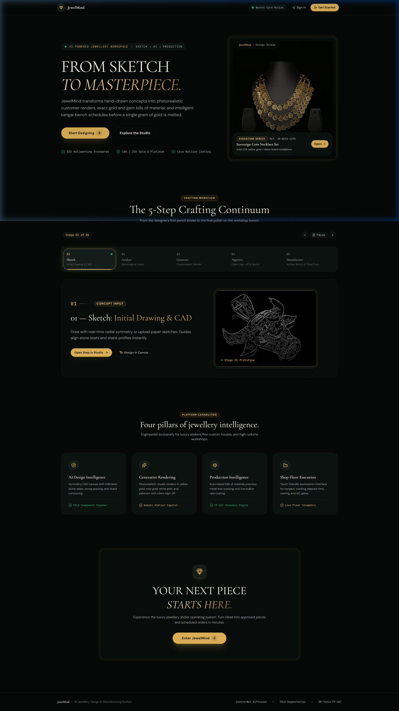 |
| **Executive Atelier Dashboard** | 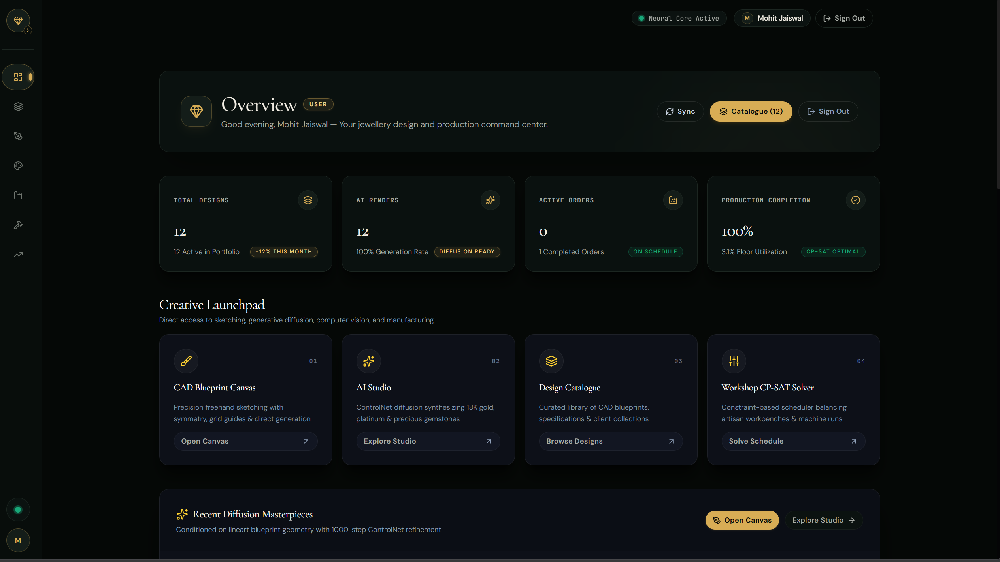 |
| **Canva: Drawing Desk (Doodle-to-Render)** | 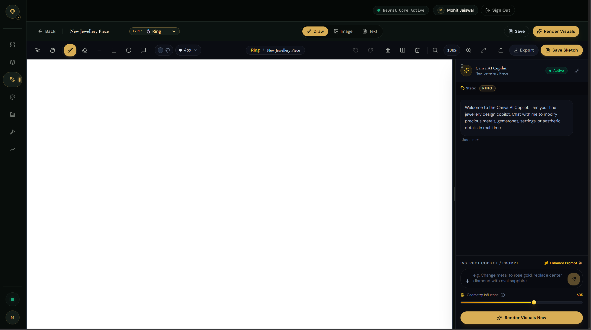 |
| **Canva: Text-to-Render Prompt Studio** | 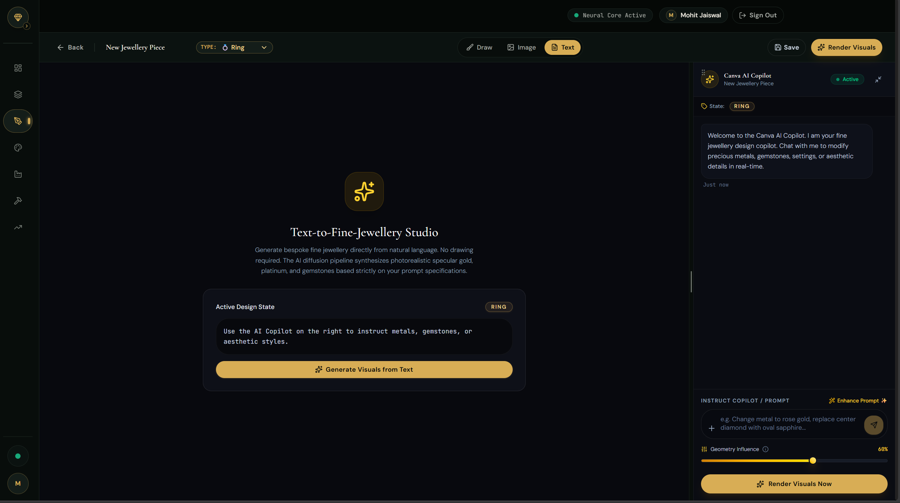 |
| **Canva: Gemological Scan (Image-to-Render)** | 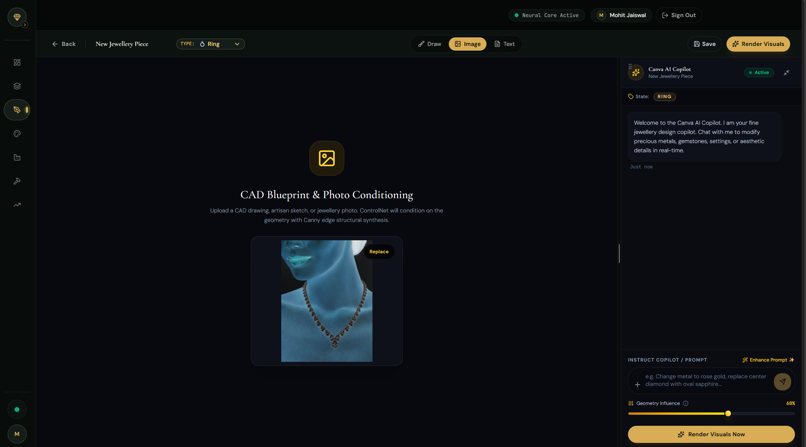 |
| **Production Studio & Media History** | 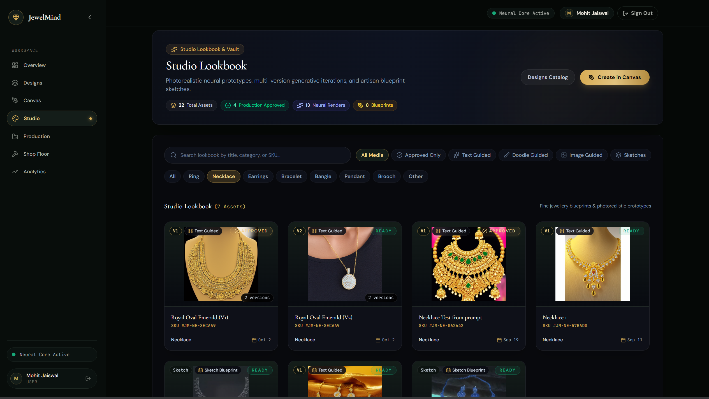 |
| **Design Catalogue** |  |
| **Production Command Center** | 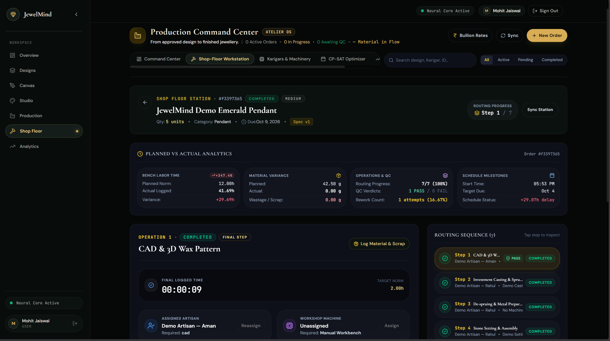 |
| **Karigar Shop Floor Terminal** | 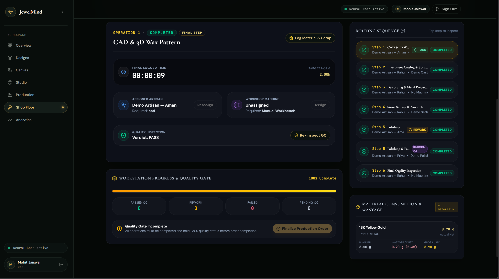 |
| **Workshop Yield & Scrap Analytics** | 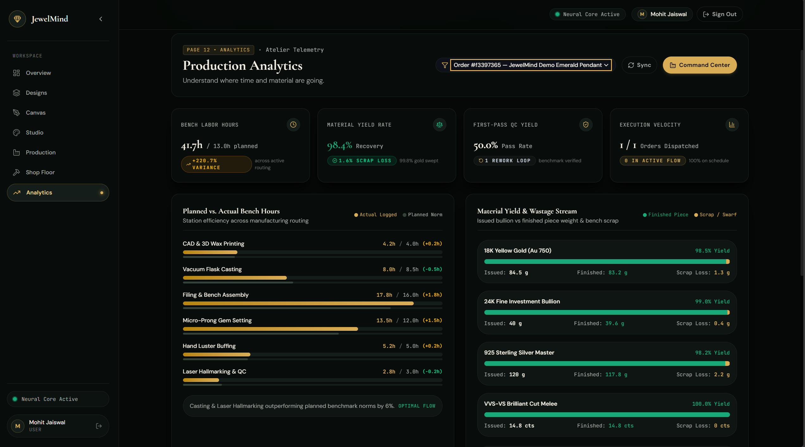 |
| **Authentication: Sign In** | 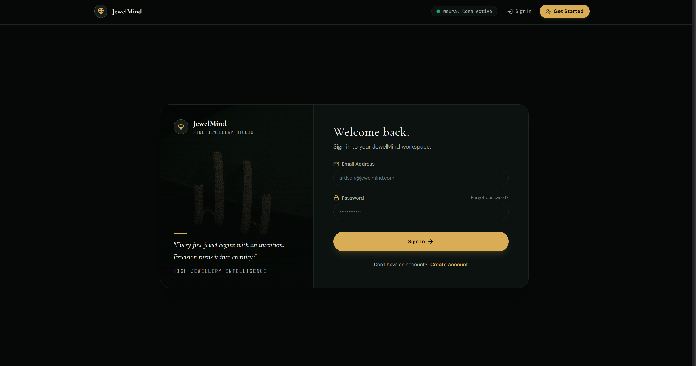 |
| **Authentication: Sign Up** | 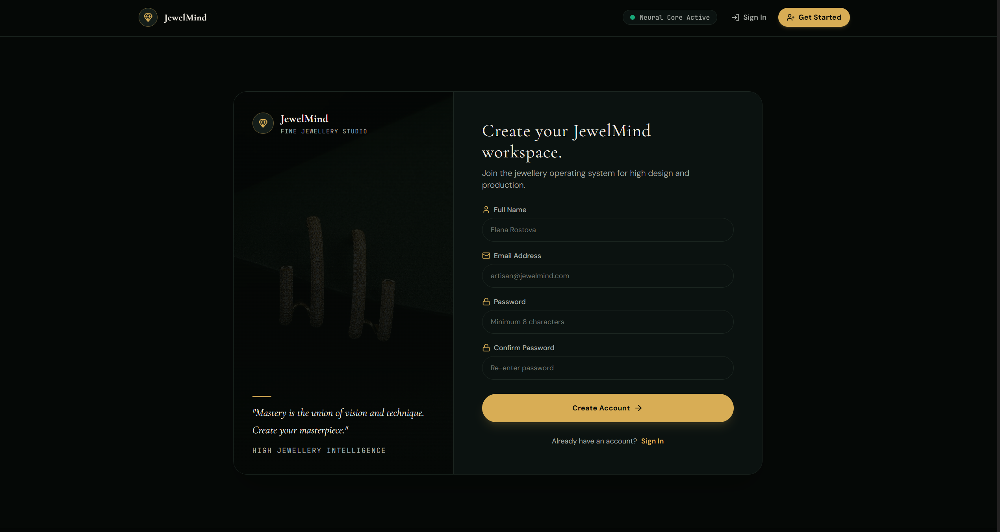 |

</details>

---

## ✨ Core Features

- **🎨 Symmetry Drawing Canvas (Canva Workspace)**: Real-time 2-way, 4-way, and radial symmetry drawing engine with stone seat guides, prong aligners, and vector smoothing.
- **👁️ Gemological Computer Vision**: Integrated YOLO11 / YOLOv8 segmentation that automatically classifies stones, counts prongs, detects center gems, and checks manufacturability.
- **✨ Dual AI Rendering Pipelines**:
  - **Local CUDA GPU Pipeline**: Stable Diffusion 1.5 + ControlNet (Canny & Tile) + custom fine-tuned Jewellery LoRA models.
  - **Cloud Multi-Modal Pipeline**: Google Gemini 2.5 Flash for conversational design refinement, style recommendations, and prompts.
- **📋 Automated Bill of Materials (BOM) & Valuation**: Calculates exact metal weights, diamond carats, labor wastage, and Indian market daily bullion rates (24K, 22K, 18K gold).
- **⏱️ Constraint-Based Scheduling (OR-Tools CP-SAT)**: Mathematical optimization that schedules cast, set, polish, and QC tasks across karigar workstations while honoring worker skills and machine limits.
- **🏭 Karigar Workstation Terminal**: Touch-friendly interface with step timers, live job dispatches, material consumption logging, and multi-point QC approval gates.
- **📊 Real-time Yield & Loss Analytics**: Live scrap tracking, planned vs. actual variance reporting, karigar efficiency rankings, and bottleneck discovery.
- **⚡ High-Performance Architecture**: Lazy-loaded route chunks, progressive WebP/JPEG assets, and resilient HTTP timeouts with graceful offline fallbacks.

---

## 🛠️ Tech Stack

| Category | Technology | Description |
| :--- | :--- | :--- |
| **Frontend Framework** | React 19, TypeScript, Vite | Lightning-fast component tree with on-demand code splitting |
| **Styling & Design System** | Tailwind CSS v4, Lucide Icons | Atelier luxury aesthetic with custom gold palettes and fluid animations |
| **Backend Framework** | FastAPI, Pydantic v2, Starlette | High-throughput asynchronous Python REST API with automatic OpenAPI docs |
| **Database & ORM** | SQLite / PostgreSQL, SQLAlchemy 2.0 | Async database access with transactional order and design storage |
| **Authentication** | OAuth2 Password Bearer, PyJWT, Passlib | Secure salt-hashed authentication with configurable session lifespans |
| **Generative AI** | Stable Diffusion 1.5, ControlNet, LoRA | Diffusion pipeline generating photorealistic metal textures and gem fire |
| **Computer Vision** | YOLO11-seg, OpenCV, Pillow | Component contouring, prong detection, and design segmentation |
| **Mathematical Optimization** | Google OR-Tools CP-SAT | Finite-domain constraint programming for workshop bench scheduling |
| **Conversational AI** | Google Gemini 2.5 Flash | Real-time design assistant with contextual gemological knowledge |
| **Testing Suite** | Pytest, Vitest, Playwright | Comprehensive unit, integration, and E2E coverage across frontend & backend |

---

## 🏗️ System Architecture

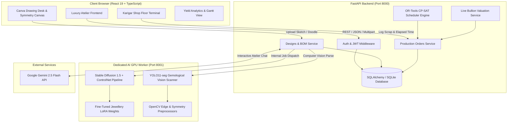

---

## 📊 End-to-End Workflow

The 5-stage **Crafting Continuum** bridges every step between initial creative vision and the final hallmarked piece:

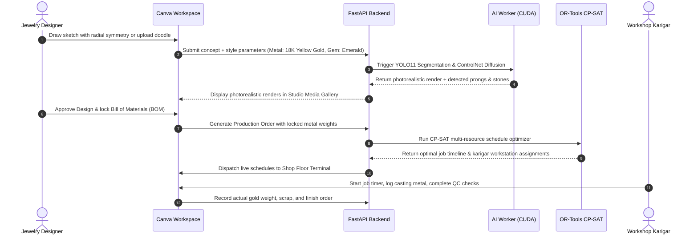

---

## 📁 Project Structure

```
JewelMind/
├── backend/                    # FastAPI REST API & Core Business Services
│   ├── app/
│   │   ├── api/                # API route controllers (v1 endpoints)
│   │   │   └── v1/             # Auth, Designs, Production, Execution, Health
│   │   ├── core/               # Configuration, security, JWT helpers
│   │   ├── models/             # SQLAlchemy ORM models (Design, Order, Worker, Machine)
│   │   ├── schemas/            # Pydantic validation schemas
│   │   └── services/           # Services (Auth, Design, Production, OR-Tools Scheduler)
│   ├── tests/                  # Pytest test suite (495+ tests)
│   └── requirements.txt        # Python backend dependencies
├── ai/                         # Dedicated AI GPU Inference Worker
│   ├── rendering/              # Stable Diffusion + ControlNet + LoRA rendering
│   ├── vision/                 # YOLO11 component detection & stone classification
│   ├── optimization/           # Google OR-Tools CP-SAT workshop optimization
│   └── workers/                # Local GPU worker daemon (local_worker.py)
├── frontend/                   # React 19 + TypeScript + Vite Web Application
│   ├── public/
│   │   └── assets/             # Brand SVGs, icons, and web-optimized photography
│   ├── src/
│   │   ├── components/         # Canvas, Navigation, Production, Studio, UI primitives
│   │   ├── context/            # AuthContext and global application state
│   │   ├── hooks/              # useAuth, useDebounce, custom hooks
│   │   ├── pages/              # Landing, Dashboard, Canva Workspace, Studio, Production
│   │   ├── services/           # Type-safe API client, auth, design, and execution services
│   │   └── types/              # TypeScript contracts and domain models
│   ├── package.json            # Node dependencies and build scripts
│   └── vite.config.ts          # Vite build config with reverse proxies
├── launchers/                  # 1-Click execution scripts for Windows
│   ├── run_all.bat             # Concurrently launch Backend, AI Worker, and Frontend
│   ├── run_backend.bat         # Launch FastAPI backend
│   ├── run_ai.bat              # Launch AI GPU worker
│   └── run_frontend.bat        # Launch Vite dev server
├── screenshots/                # Showcase imagery for documentation
└── README.md                   # Project documentation
```

---

## 💡 Key Modules Explained

### 1. Canva Workspace (Drawing Desk)
- Features freehand drawing, straight line guides, eraser, radial symmetry dials (2x, 4x, 8x), and undo/redo stacks.
- Supports **Doodle-to-Render**, **Text-to-Render**, and **Image-to-Render** workflows with real-time prompt builders for precious metal alloys, prong settings, and gemstone cuts.

### 2. Gemological Vision Engine
- Leverages custom YOLO segmentation weights trained on jewellery datasets.
- Automatically isolates center gems, pavé accent stones, prongs, and shanks, calculating bounding dimensions and validating structural casting integrity.

### 3. Production Intelligence & CP-SAT Optimizer
- Solves a Job-Shop Scheduling Problem (JSSP) using Google OR-Tools CP-SAT.
- Balances workstation capacities across 4 major manufacturing stages: **Wax 3D Printing / Casting**, **Stone Setting**, **Polishing & Finishing**, and **Quality Control**.
- Optimizes for minimal makespan while preventing karigar burnout and machine conflicts.

### 4. Live Bullion Valuation & Scrap Tracking
- Dynamic BOM calculation accounting for density conversion factors (e.g., silver wax model weight to 18K gold equivalent).
- Integrates daily gold, platinum, and silver rates with karat purity adjustments (999, 916, 750) and records alloy additions and scrap recovery percentages.

---

## 🧪 Automated Testing Suite

JewelMind enforces continuous quality assurance across all layers:

### 1. Backend Pytest Suite
```powershell
.\backend\.venv\Scripts\pytest backend/tests
```
> **Status:** 495 passed tests covering JWT authentication, design persistence, production state machines, and schedule constraints.

### 2. Frontend Vitest Suite
```powershell
cd frontend
npm test -- --run
```
> **Status:** 12 test suites (132 tests) passed cleanly with 100% coverage over navigation, canvas tools, scheduling, and valuation arithmetic.

### 3. Production Build Validation
```powershell
cd frontend
npm run build
```
> **Status:** Compiles clean TypeScript with on-demand code splitting and sub-second Vite production bundling.

---

## 🚀 Future Improvements

- [ ] **3D WebGL / Three.js Model Viewer**: Direct GLTF / OBJ interactive 3D model rotation and stone facet rendering in the browser.
- [ ] **RFID / Barcode Scanner Integration**: Physical workshop batch tracking via Bluetooth barcode scanners at each workbench.
- [ ] **Automated Customer Quotation PDF**: One-click export of luxury branded spec sheets with photorealistic renders, BOM breakdowns, and hallmark certification certificates.
- [ ] **Hallmarking & Laser Inscription Ledger**: Serialized micro-inscriptions tracking diamond cert numbers (GIA, IGI) directly through production.
- [ ] **Multi-Tenant Factory Management**: Support for multi-branch jewellery manufacturers with distributed workshop dispatching.

---

## 🤝 Contributing

Contributions are welcome! Please follow these steps:

1. Fork the Project
2. Create your Feature Branch (`git checkout -b feature/AmazingFeature`)
3. Commit your Changes (`git commit -m 'Add AmazingFeature'`)
4. Push to the Branch (`git push origin feature/AmazingFeature`)
5. Open a Pull Request

---

## 📄 License

Distributed under the **MIT License**. See `LICENSE` for more information.

---

## 👨‍💻 Author & Contact

**Mohit Jaiswal**  
*Undergraduate Computer Science Student*

- **GitHub**: [@MohitJaiswal2507](https://github.com/MohitJaiswal2507)
- **Email**: [mohitjasiwal2507@gmail.com](mailto:mohitjasiwal2507@gmail.com)

---

## 🙏 Acknowledgements

- [Ultralytics YOLO](https://github.com/ultralytics/ultralytics)
- [Hugging Face Diffusers & ControlNet](https://github.com/huggingface/diffusers)
- [Google OR-Tools](https://developers.google.com/optimization)
- [Google Gemini API](https://ai.google.dev/)
- [FastAPI](https://fastapi.tiangolo.com/)
- [React](https://react.dev/) & [Tailwind CSS](https://tailwindcss.com/)
- [Lucide Icons](https://lucide.dev/)