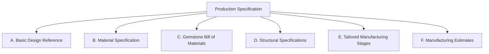
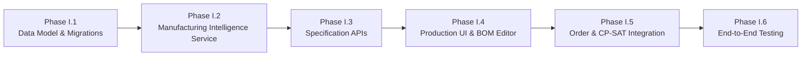

# PHASE I — PRODUCTION INTELLIGENCE & MANUFACTURING WORKFLOW
## Architecture & Feasibility Audit Report

**Project:** JewelMind  
**Branch:** `phase-i-production-intelligence`  
**Date:** 2026-09-21  
**Audit Type:** Read-Only Architectural Inspection & Implementation Blueprint  
**Status:** Audit Completed — Read-Only Preserved — No Source Code or Models Modified  

---

## Executive Summary

This audit evaluates the feasibility, data model requirements, AI integration points, and workflow mechanics necessary to turn an **approved photorealistic jewellery render** into an actionable, structured **Production Specification (Bill of Materials & Manufacturing Routing)** within JewelMind.

Prior to Phase I, JewelMind implemented:
1. **Photorealistic Render Synthesis** (Text, Doodle, and Reference-Image multi-modal rendering with Gemini 2.5 Flash prompt expansion, YOLO segmentation, ControlNet, and SD1.5).
2. **Phase H Persistent Studio & Render History** (Design → DesignRender version tree V1..Vn with immutability, approved render status, and foreign key integrity).
3. **Workshop Resource Management & CP-SAT Scheduling** (Workers, Machines, Production Orders, and Google OR-Tools CP-SAT job-shop scheduling).

**The Core Architectural Gap Identified:**
The current production subsystem links a `ProductionOrder` directly to a `Design` and an optional `render_id` / `approved_render_url`, but **contains zero manufacturing intelligence**. The production optimizer indiscriminately schedules three static, hardcoded operations (`Casting & Metallurgy`, `Stone Setting & Assembly`, `Polishing & Finishing`) using generic linear duration formulas (`base_hours + qty * per_unit_hours`) regardless of whether the piece is an intricate diamond pavé necklace, a bezel-set emerald ring, or a plain silver band with no stones at all. No Bill of Materials (BOM), metal weight estimates, gemstone layouts, structural dimensions, or quality assurance checkpoints exist between the artistic render and the workshop floor.

Phase I bridges this gap with a dedicated, version-locked **Production Specification** architecture.

---

## 1. Current Production Architecture

A comprehensive inspection of the existing production subsystem was conducted across database models, Pydantic schemas, API routers, business services, frontend interfaces, and test suites.

### Inventory & Capability Matrix

| Component | Files Inspected | Status | Description / Observations |
| :--- | :--- | :--- | :--- |
| **Production Order Model** | `backend/app/models/production.py` (`ProductionOrder`) | **EXISTS** | Stores `user_id`, `design_id`, `quantity`, `priority` (`urgent`, `high`, `medium`, `low`), `status` (`pending`, `in_progress`, `completed`, `cancelled`), `deadline`, `notes`, `render_id`, `approved_render_url`. |
| **Workshop Resource Models** | `backend/app/models/production.py` (`Worker`, `Machine`) | **EXISTS** | Workers store `name`, `skill` (`cad_design`, `casting`, `stone_setting`, `polishing`, `engraving`, `general`), `capacity_hours_per_day`, `is_available`. Machines store `name`, `machine_type` (`laser_engraver`, `3d_wax_printer`, `casting_furnace`, `cnc_milling`, `polishing_lathe`, `ultrasonic_cleaner`, `general`), `capacity_hours_per_day`, `is_available`. |
| **Schedule Models** | `backend/app/models/schedule.py` (`ProductionSchedule`, `ScheduledTask`) | **EXISTS** | Stores solver run metrics, schedule status, and individual scheduled task assignments (`order_id`, `worker_id`, `machine_id`, `operation_name`, `start_time`, `end_time`, `duration_hours`). |
| **Production Schemas** | `backend/app/schemas/production.py` | **EXISTS** | Complete Pydantic schemas for `ProductionOrderCreate`, `Update`, `Response`, `Worker*`, `Machine*`, and `ProductionSummaryResponse`. |
| **Optimization Schemas** | `backend/app/schemas/optimization.py` | **EXISTS** | Schemas for `OptimizationRequest`, `OptimizationResponse`, `ScheduledTaskResponse`, `ProductionScheduleResponse`, and `SolverStatusEnum`. |
| **Production APIs** | `backend/app/api/v1/production.py` | **EXISTS** | Full REST endpoints: `/summary`, `/orders` (CRUD), `/workers` (CRUD), `/machines` (CRUD), `/optimize`, `/schedules`. |
| **Production Service** | `backend/app/services/production_service.py` | **EXISTS** | Database operations for orders, workers, machines, and summary KPI calculation. |
| **Optimization Service** | `backend/app/services/production_optimization_service.py` | **PARTIALLY EXISTS** | CP-SAT job-shop formulation is mathematically sound, but operations are hardcoded in `OPERATION_DEFS` (Casting, Stone Setting, Polishing) with no awareness of jewellery category, gemstone presence, or metal specification. |
| **Production UI** | `frontend/src/pages/ProductionPage.tsx` | **EXISTS** | 4-tab dashboard (`orders`, `workers`, `machines`, `optimization`), KPI overview cards, creation/edit modals, Gantt/timeline schedule visualization. |
| **Production Specification Entity** | — | **MISSING** | No database model, schema, or API exists to represent a Bill of Materials, metal weight, gemstone requirements, or tailored manufacturing steps. |
| **Manufacturing AI Service** | — | **MISSING** | Gemini is currently utilized exclusively for visual prompt expansion (`gemini_design_service.py`), not for manufacturing specifications or material estimation. |
| **Specification Approval Gate** | — | **MISSING** | No mechanism exists for an artisan to review, edit, and approve manufacturing parameters prior to order dispatch. |

---

## 2. Approved Render → Production Linkage

### Phase H Integration Trace

The relationship between designs, persistent render versions, and production orders was audited in `backend/app/models/design.py`, `backend/app/models/production.py`, and `backend/app/services/production_service.py`:

```
Design (1)
 ├── DesignRender (N) [V1, V2, V3...]
 │     ├── version_number: int
 │     ├── is_approved_for_production: bool
 │     ├── structured_state: JSONB
 │     ├── image_url: str
 │     └── parent_render_id: UUID
 │
 └── ProductionOrder (N)
       ├── design_id: ForeignKey("designs.id", ondelete="CASCADE")
       ├── render_id: ForeignKey("design_renders.id", ondelete="SET NULL")
       └── approved_render_url: str (snapshot)
```

### Exact Current Behaviors Verified

1. **How `render_id` is stored:**
   `ProductionOrder.render_id` is a nullable foreign key column referencing `design_renders.id` with `ondelete="SET NULL"`.
2. **How `approved_render_url` is stored:**
   `ProductionOrder.approved_render_url` is a `String(1024)` column. When creating an order with `render_id`, if `approved_render_url` is not explicitly provided in the request body, `ProductionService.create_order` automatically queries `DesignRender.image_url` and persists it as an immutable snapshot.
3. **Exact Render Version Reference:**
   `ProductionOrder` points directly to the specific UUID of the `DesignRender` row (e.g. Render V3). It does not point to a generic "latest" pointer on `Design`.
4. **Impact of Creating Subsequent Renders:**
   Creating Render V4 does **NOT** alter existing `ProductionOrder` rows. The existing order remains strictly bound to `render_id=V3` and retains its `approved_render_url` snapshot.
5. **Accidental Deletion Protection:**
   In Phase H, `DesignService.delete_render` was hardened to query `production_orders.render_id`. Attempting to delete an approved render currently referenced by an active production order raises `HTTP 409 Conflict` (`ORDER_REFERENCED_RENDER`).
6. **Order Creation Requirement:**
   Currently, linking an approved render is **optional**. A user can create a `ProductionOrder` with only `design_id`, leaving `render_id=None`. For Phase I, production orders originating from the Design Studio must enforce an approved render and approved specification.
7. **Tenant Ownership Validation:**
   `ProductionService.create_order` explicitly verifies that `Design.user_id == current_user.id`. Cross-tenant design linkage is strictly rejected with `HTTP 404 DESIGN_NOT_FOUND`.

---

## 3. Design Data Available for Production

An audit of `Design`, `DesignRender.structured_state`, and `GeminiDesignService` schemas reveals what data currently exists and what must be added:

| Field Group | Sub-Field | Current Availability | Source in Codebase | Manufacturing Readiness |
| :--- | :--- | :--- | :--- | :--- |
| **Category** | Jewellery Category | **EXISTS** (Exact) | `Design.category` (`ring`, `earring`, `pendant`, `necklace`, `bracelet`, `bangle`, `brooch`, `other_jewellery`) | Ready for stage branching. |
| **Material** | Metal Type | **PARTIALLY EXISTS** | `DesignRender.structured_state["material"]["metal"]` | String value (e.g. "gold", "platinum", "silver"). Needs normalization to manufacturing alloys. |
| | Metal Purity / Karat | **PARTIALLY EXISTS** | `DesignRender.structured_state["material"]["purity"]` | Descriptive string (e.g. "18k", "950", "925"). Needs conversion to specific density factors. |
| | Metal Finish | **PARTIALLY EXISTS** | `DesignRender.structured_state["material"]["finish"]` | e.g. "high_polish", "matte", "hammered", "brushed". |
| | Plating | **CAN BE DERIVED** | `DesignRender.structured_state["material"]["plating"]` | e.g. "rhodium", "gold_vermeil", "rose_gold". |
| | Rough Casting Weight (g) | **MISSING** | None | Must be estimated from category + dimensions. |
| | Net Finished Weight (g) | **MISSING** | None | Must be estimated with casting shrinkage/loss allowance (~8–12%). |
| **Gemstones** | Gemstone Type | **PARTIALLY EXISTS** | `DesignRender.structured_state["gemstones"][0]["gemstone_type"]` | e.g. "diamond", "emerald", "sapphire". |
| | Stone Count | **PARTIALLY EXISTS** | `DesignRender.structured_state["gemstones"][0]["count"]` | Integer count in structured state, but often omitted for complex pavé. |
| | Cut / Shape | **PARTIALLY EXISTS** | `DesignRender.structured_state["gemstones"][0]["cut"]` or `["shape"]` | e.g. "round_brilliant", "cushion", "oval", "pear", "emerald_cut". |
| | Stone Dimensions / Carat | **MISSING** | None | AI can provide estimated mm/carat brackets, but physical calipers are required at the bench. |
| | Setting Method | **PARTIALLY EXISTS** | `DesignRender.structured_state["gemstones"][0]["setting_type"]` | e.g. "prong", "bezel", "channel", "pavé", "tension", "flush". |
| **Structure** | Outer / Inner Dimensions | **MISSING** | None | Ring finger size, necklace chain length (cm), earring drop (mm). |
| | Band / Shank Thickness | **MISSING** | None | Critical for casting structural integrity (minimum 1.2–1.5mm). |
| | Sub-Components | **CAN BE DERIVED** | `DesignRender.structured_state["structural_elements"]` | e.g. `["shank", "head", "gallery", "prongs", "halo"]`. |
| **AI Data** | Gemini Prompt & Enhanced Prompt | **EXISTS** | `DesignRender.prompt`, `DesignRender.enhanced_prompt` | Contains rich natural language descriptions of the piece. |
| | Structured Visual State | **EXISTS** | `DesignRender.structured_state` (JSONB) | Contains visual parameters used to generate the image. |
| | YOLO Bounding BBoxes | **EXISTS** | AI detection output (`yolo11n-seg.pt`) | Can confirm single piece vs. pair (earrings). |
| | ControlNet / LoRA info | **EXISTS** | `DesignRender.control_type`, `control_strength` | Retained for synthesis traceability. |

---

## 4. Gemini Integration Audit

### Current Pipeline Trace
```
User Prompt / Sketch / Asset
        ↓
GeminiDesignService.extract_structured_design()
        ↓
StructuredDesignUnderstanding (Pydantic Schema)
        ↓
JewelleryPromptCompiler.compile_render_prompts()
        ↓
Renderer Pipeline (SD1.5 / ControlNet / LoRA)
        ↓
DesignRender (Persisted with structured_state JSONB)
```

### Key Findings on Gemini Capabilities
1. **Schema Separation:**
   `StructuredDesignUnderstanding` in `backend/app/schemas/ai.py` is tailored strictly for image generation aesthetics: lighting conditions, viewing angle, background, art style, and keyword tokens.
2. **Missing Manufacturing Prompts:**
   Gemini 2.5 Flash has extensive domain knowledge of jewellery manufacturing metallurgy, wax 3D printing tolerances, loss factors in lost-wax casting, stone setting difficulty, and finishing protocols. However, **no manufacturing prompt or schema currently asks Gemini for this information**.
3. **Architecture Recommendation — Dedicated Manufacturing Analysis Service:**
   We recommend creating a **dedicated manufacturing analysis module** (`backend/app/services/gemini_production_service.py`) rather than overloading `GeminiDesignService`.
   - **Why?** Image generation and production planning have different lifecycles, schemas, rate limits, and latency profiles.
   - **Input:** The approved `DesignRender` (photorealistic image URL or base64 + `Design.category` + `DesignRender.structured_state` + user prompt).
   - **Output:** A strongly typed `ProductionSpecificationAIResponse` containing estimated metal weights, gemstone BOM breakdown, tailored manufacturing stages with skill/machine requirements, and fabrication risk warnings.
   - **Fallback:** If `GEMINI_API_KEY` is not configured or fails, the service must execute a **deterministic fallback rule engine** based on `Design.category` to populate standard jewellery industry baselines.

---

## 5. Production Specification Gap Analysis

JewelMind must introduce a unified **Production Specification** containing six structured dimensions:



### A. Basic Design Reference
- `design_id`: Parent jewellery design.
- `render_id`: Approved photorealistic render version.
- `jewellery_category`: Standardized category enum.
- `specification_version`: Integer revision counter (starts at 1).
- `approval_status`: `draft` | `artisan_reviewed` | `approved` | `archived`.

### B. Material Specification
- Primary metal alloy (e.g. `18K Yellow Gold`, `18K White Gold`, `18K Rose Gold`, `Platinum 950`, `Sterling Silver 925`).
- Purity percentage and density multiplier ($g/cm^3$).
- Surface finish specification (`High Polish Mirror`, `Satin Matte`, `Brushed Micro-texture`, `Hammered Artisan`).
- Electroplating requirement (`None`, `Rhodium Flash 0.5µm`, `18K Heavy Gold Electroplate 2.5µm`).

### C. Gemstone Bill of Materials (BOM)
Structured as an array of line items:
- Gemstone species (`Natural Diamond`, `Lab Diamond`, `Emerald`, `Blue Sapphire`, `Ruby`, `Moissanite`, `Pearl`, `None`).
- Shape / Cut (`Round Brilliant`, `Princess`, `Emerald Cut`, `Oval`, `Pear`, `Marquise`, `Cushion`, `Baguette`).
- Piece count.
- Approximate size bracket (e.g. `1.2mm pavé`, `6.5mm / 1.00ct center`).
- Setting style (`4-Prong Claw`, `6-Prong Tiffany`, `Bezel Full`, `Micro-Pavé`, `Channel`, `Flush Gypsy`).
- Bench setting difficulty rating (`Standard`, `Delicate`, `High Risk`).

### D. Structural Specifications
- Nominal size / dimension (e.g. Ring US Size 7, Bangle 60mm inner diameter, Necklace 45cm + 5cm extender).
- Minimum band/wall thickness (mm) for structural integrity.
- Component breakdown (e.g. Main body, central collet, peg bail, butterfly friction backs).
- Fabrication notes (e.g. "Hollow gallery beneath center collet to maximize light return").

### E. Tailored Manufacturing Stages (Routing)
Instead of hardcoding three stages for all items, the routing must dynamically adapt to the jewellery category and BOM:

| Standard Stage | Required Skill | Required Machine | Condition |
| :--- | :--- | :--- | :--- |
| **1. CAD & 3D Wax Pattern Printing** | `cad_design` | `3d_wax_printer` | Universal for cast designs |
| **2. Investment Casting & De-spruing** | `casting` | `casting_furnace` | Universal for cast designs |
| **3. Clean-up, Filing & Pre-polish** | `polishing` | `ultrasonic_cleaner` | Universal |
| **4. Stone Setting & Collet Adjustment** | `stone_setting` | Benchwork (Hand tools) | **Only if gemstone count > 0** |
| **5. Final Lapping & Mirror Polishing** | `polishing` | `polishing_lathe` | Universal |
| **6. Electroplating & Ultrasonic Wash** | `polishing` | `ultrasonic_cleaner` | **Only if plating required** (e.g. White Gold / Silver) |
| **7. Laser Engraving & Hallmarking** | `engraving` | `laser_engraver` | Optional / Standard |
| **8. Quality Assurance & Dimension QC** | `general` | Optical Microscope | Universal gate before packaging |

### F. Estimates: AI Inferred vs. Physically Measured
To maintain strict industrial integrity, the system must cleanly delineate estimates from bench measurements:
- **Estimated Rough Metal Weight:** AI calculation based on category volume averages + spruing allowance.
- **Estimated Net Finished Weight:** AI calculation minus filing/polishing metal loss (~8–10%).
- **Estimated Total Bench Time:** Dynamic sum of selected stage durations based on stone count and complexity.
- **Actual Scale Weight & Carat Weight:** Populated by bench jewelers during production order fulfillment.

---

## 6. Data Model Design Audit

The database schema must be cleanly normalized and respect multi-tenant isolation and foreign key integrity.

### Proposed Entity Relationship Diagram

```
users (existing)
  │
  ├── designs (existing)
  │     │
  │     ├── design_renders (existing, Phase H)
  │     │     │
  │     │     └── production_specifications (NEW Phase I)
  │     │           │
  │     │           ├── production_materials (NEW Phase I)
  │     │           ├── production_gemstones (NEW Phase I)
  │     │           └── production_steps (NEW Phase I)
  │     │                 │
  │     └── production_orders (existing, updated with specification_id)
  │           │
  │           └── scheduled_tasks (existing)
```

### Entity Specifications

#### 1. `ProductionSpecification` (`production_specifications`)
- `id`: UUID (Primary Key).
- `user_id`: UUID (Foreign Key `users.id`, `ondelete="CASCADE"`).
- `design_id`: UUID (Foreign Key `designs.id`, `ondelete="CASCADE"`).
- `render_id`: UUID (Foreign Key `design_renders.id`, `ondelete="RESTRICT"`).
- `version_number`: Integer (defaults to 1).
- `status`: String (`draft`, `approved`, `archived`).
- `category`: String (mirrors `Design.category`).
- `estimated_rough_metal_weight_grams`: Float (nullable).
- `estimated_finished_metal_weight_grams`: Float (nullable).
- `total_gemstone_count`: Integer (default 0).
- `estimated_total_bench_hours`: Float (nullable).
- `complexity_rating`: String (`simple`, `moderate`, `intricate`, `masterpiece`).
- `fabrication_notes`: Text (nullable).
- `ai_confidence_score`: Float (0.0 to 1.0).
- `approved_at`: DateTime (nullable).
- `created_at`, `updated_at`: DateTime (TimestampMixin).

#### 2. `ProductionMaterial` (`production_materials`)
- `id`: UUID (Primary Key).
- `specification_id`: UUID (Foreign Key `production_specifications.id`, `ondelete="CASCADE"`).
- `metal_type`: String (`gold`, `platinum`, `silver`, `titanium`, `brass`).
- `metal_purity`: String (`18k`, `14k`, `950`, `925`).
- `metal_color`: String (`yellow`, `white`, `rose`, `dual_tone`).
- `metal_finish`: String (`high_polish`, `matte`, `hammered`, `brushed`).
- `plating`: Optional[String] (`rhodium`, `gold_vermeil`, `none`).
- `estimated_weight_grams`: Float.
- `casting_loss_percentage`: Float (default 10.0).

#### 3. `ProductionGemstone` (`production_gemstones`)
- `id`: UUID (Primary Key).
- `specification_id`: UUID (Foreign Key `production_specifications.id`, `ondelete="CASCADE"`).
- `gemstone_type`: String (`diamond`, `emerald`, `sapphire`, `ruby`, `moissanite`, `pearl`, etc.).
- `cut_shape`: String (`round`, `princess`, `oval`, `pear`, `emerald`, `cushion`, `marquise`, `baguette`).
- `stone_count`: Integer (default 1).
- `estimated_carat_weight`: Optional[Float].
- `approximate_dimensions_mm`: Optional[String] (e.g. "6.5mm", "1.5mm x 1.5mm").
- `setting_type`: String (`prong`, `bezel`, `channel`, `pave`, `flush`).
- `is_center_stone`: Boolean (default False).

#### 4. `ProductionStep` (`production_steps`)
- `id`: UUID (Primary Key).
- `specification_id`: UUID (Foreign Key `production_specifications.id`, `ondelete="CASCADE"`).
- `step_number`: Integer (1, 2, 3...).
- `stage_name`: String (`CAD / Wax Modeling`, `Investment Casting`, `Stone Setting`, etc.).
- `required_skill`: String (`cad_design`, `casting`, `stone_setting`, `polishing`, `engraving`, `general`).
- `required_machine_type`: Optional[String] (`3d_wax_printer`, `casting_furnace`, `polishing_lathe`, `laser_engraver`, etc.).
- `base_hours`: Float.
- `per_unit_hours`: Float.
- `description`: Text.
- `quality_checkpoint`: Optional[String] (acceptance criteria for this stage).

---

## 7. Versioning & Immutability

### Architectural Principle: Render-Locked Specifications

A production specification must be permanently bound to the exact `DesignRender` version that originated it.

```
Design: "Royal Peacock Emerald Ring"
 ├── Render V1 (Draft render)
 ├── Render V2 (Refined setting)
 ├── Render V3 (APPROVED by client)
 │     └── Production Specification V1 (Approved BOM: 18K Gold, 5.8g, 1 Emerald, 18 Diamonds)
 │           └── Production Order #101 (Dispatched to casting)
 │
 └── Render V4 (Subsequent exploration: Sapphire variation)
       └── (Does NOT alter Render V3, Specification V1, or Order #101)
```

### Invariant Rules
1. **No Silent Mutation:** Creating Render V4 must never modify or invalidate Specification V1.
2. **Freeze on Approval:** Once a `ProductionSpecification` transitions to `approved` and is linked to an active `ProductionOrder`, its BOM items, stages, and metal requirements become **immutable**.
3. **Re-rendering Branching:** If the client decides to manufacture Render V4, a new `ProductionSpecification` (with `version_number=2` or independent specification entity) is instantiated, bound to `render_id=V4`.
4. **Deletion Protection:** A `DesignRender` referenced by a `ProductionSpecification` cannot be deleted (`RESTRICT` or application-level `HTTP 409 Conflict`).

---

## 8. Production Order Workflow

### Comparative Workflow Evaluation

#### Workflow Option A: Approved Render → Production Specification → Production Order (RECOMMENDED)
```
Approved Render (V3)
        ↓
Generate Specification (AI Domain Analysis + Fallback)
        ↓
Artisan Review & Customization (Edit Weights, Stones, Stages)
        ↓
Approve Specification (Locks the Blueprint)
        ↓
Create Production Order (Instantiates Batch with Exact Tailored Routing)
        ↓
CP-SAT Optimization & Workshop Dispatch
```
- **Advantages:** Prevents invalid orders from reaching the workshop; ensures accurate material reservation and scheduling constraints; matches true fine jewellery atelier practice.

#### Workflow Option B: Approved Render → Production Order → Production Specification
```
Approved Render (V3)
        ↓
Create Production Order (Generic Order Record)
        ↓
Attach / Generate Specification Retroactively
```
- **Disadvantages:** The order enters the scheduling system with dummy operations before anyone knows how many stones need to be set or how long casting will take; creates race conditions in CP-SAT scheduling.

### Recommendation
**Adopt Workflow Option A.** An artisan approves the render, reviews/edits the generated specification, approves the specification, and then launches the production order.

---

## 9. Material & Gemstone Estimation

### Physical Reality vs. 2D AI Inference

JewelMind operates on 2D photorealistic renders, digital sketches, and natural language prompts. It does **not** ingest 3D CAD volumetric solids (STLs/STEP files).

| Dimension | Exact Measurement Possible from 2D? | Method Available in JewelMind | Classification |
| :--- | :--- | :--- | :--- |
| **Metal Volume & Weight** | **NO** (Wall thickness, hollow recesses, and internal cavities are occluded). | Volumetric approximation based on category archetypes + density tables ($18K = 15.5 g/cm^3$, $Pt950 = 21.45 g/cm^3$, $Ag925 = 10.36 g/cm^3$). | **AI INFERENCE / ESTIMATION** (Must be labeled as estimate; user must have full edit access). |
| **Gemstone Count** | **PARTIALLY** (Visible prongs and stones can be counted; hidden pavilion stones or underside gallery pavé cannot). | Multi-modal vision analysis (Gemini 2.5 Flash counting visible settings). | **AI INFERENCE** (User must verify). |
| **Gemstone Carat Weight** | **NO** (Carat requires 3D depth and density). | Standard mm-to-carat diamond conversion tables for round brilliant and standard fancy shapes. | **ESTIMATION** (Derived from approximate mm diameter). |
| **Bench Labor Duration** | **NO** (Depends on artisan skill and metal hardness). | Parametric calculation: $Time = Base + \sum(StoneCount \times SettingRate) + MetalPolishingFactor$. | **SYSTEM DERIVED ESTIMATION** (Configurable in workshop settings). |
| **Scale Weight at Delivery** | **YES** | Physical digital scale input at completion. | **EXACT PHYSICAL MEASUREMENT** (User provided during order completion). |

### Mandatory User-Editable Fields
Every field generated by AI **must be fully editable** by the master jeweler prior to specification approval:
- Metal alloy, karat, and color.
- Estimated rough cast weight and finished weight.
- Gemstone species, shape, dimensions, and piece count.
- Addition, removal, or reordering of manufacturing stages.

---

## 10. UI/UX Audit

### Existing UI Architecture (`frontend/src/pages/ProductionPage.tsx`)
`ProductionPage.tsx` currently renders four top-level tabs:
1. `orders`: Production Orders table with status filter, search, priority badges, and an "Add Order" modal.
2. `workers`: Worker cards grid displaying skills, daily capacity, availability toggle, and an "Add Worker" modal.
3. `machines`: Equipment cards grid displaying machine type, capacity, availability, and an "Add Machine" modal.
4. `optimization`: CP-SAT schedule trigger button, status banner, optimization metrics KPI panel, and a chronological Gantt/timeline schedule view.

### Recommended UI Enhancements for Phase I
1. **Design Studio Integration (`StudioPage.tsx`):**
   When a user views an approved render in the Studio Render History drawer:
   - Add a primary CTA: **"Generate Production Spec"** (`Sparkles` icon).
   - Triggers the AI manufacturing analysis and opens the **Specification Drawer / Modal**.
2. **Production Specification Modal / Drawer:**
   - **Visual Snapshot:** Shows the approved render image and version badge (`v3 Approved`).
   - **Materials Card:** Displays selected metal alloy, purity, estimated weight range (e.g. `5.5g – 6.2g`), and surface finish.
   - **Gemstones Table:** Displays detected stones with editable count, shape, and setting technique.
   - **Manufacturing Routing Timeline:** Interactive list of stages (CAD, Casting, Setting, Polishing, QC) with skill/machine requirements.
   - **Warning / Disclaimers Banner:** Clear callout that estimates require bench verification.
   - **Actions:** "Save Draft", "Edit Values", and "Approve Specification & Create Order".
3. **Production Page Integration (`ProductionPage.tsx`):**
   - Add a **"Specifications"** tab (or filter view) to view, inspect, and manage approved blueprints.
   - In the "Orders" table, display a badge linking to the associated specification (`Spec v1`).
   - In the CP-SAT Optimizer, update the task generation engine to pull **actual stages from the linked specification** rather than generic `OPERATION_DEFS`.

---

## 11. AI Safety & User Control

### Visual Badging & Truth in Labeling
To prevent dangerous assumptions on the workshop floor, the API and UI must enforce four strict data origin categories:

```
[ AI ESTIMATE — VERIFY BEFORE CASTING ]   → For auto-generated weights, stone counts, and stages.
[ ARTISAN OVERRIDE ]                      → For values modified by the user.
[ SYSTEM DERIVED ]                       → For mathematical conversions (e.g. volume × density).
[ BENCH MEASURED ]                       → For physical scale weights entered at QC.
```

### Failure Modes & Resiliency Strategy

| Failure Scenario | System Reaction | User Experience |
| :--- | :--- | :--- |
| **Gemini API Key Missing / Quota Exceeded** | Catch exception, log warning, invoke `DeterministicProductionEngine`. | Informative banner: *"AI analysis unavailable — standard industry template loaded for [Category]. Please review and adjust values."* |
| **Incomplete AI Output (e.g. missing metal)** | Schema validation fills fallback defaults from `Design.category` baseline. | Warning indicator next to incomplete fields with default values pre-filled. |
| **Ambiguous Gemstone Setting** | Gemini returns low confidence score (< 0.70). | Amber warning badge: *"Setting type uncertain from render. Please verify whether stones are prong or channel set."* |
| **Category Mismatch** | Gemini suggests ring for a necklace design. | Enforce authoritative constraint: `Design.category` overrides AI inference. |

---

## 12. Security & Ownership

### Multi-Tenancy & Authorization Audit
- **Authentication:** All production endpoints are protected by `get_current_user` (`HTTP 401 Unauthorized`).
- **Data Isolation:** All queries across `production_specifications`, `production_materials`, `production_gemstones`, and `production_steps` must include `user_id == current_user.id` or join through user-owned `designs`.
- **IDOR Protection:** Accessing `/api/v1/production/specifications/{spec_id}` with an ID belonging to another tenant must return `HTTP 404 NOT_FOUND` (preventing ID enumeration).
- **Deletion Cascade & Locking:**
  - Deleting a `Design` cascades to delete associated specifications.
  - Deleting a `DesignRender` that is referenced by an active `ProductionSpecification` or `ProductionOrder` is blocked with `HTTP 409 Conflict`.
  - Deleting an `approved` specification that is currently referenced by an active `ProductionOrder` is blocked with `HTTP 409 Conflict`.

---

## 13. Existing Test Coverage

### Backend Test Suite (Read-Only Run Execution)
The backend test suite was executed via `pytest`:
- **Result:** **198 tests passed**, 0 failed, 21 deprecation warnings (FastAPI/Starlette `HTTP_422_UNPROCESSABLE_ENTITY` alias warnings in test dependencies).
- **Execution Time:** ~40 seconds.
- **Key Modules Audited:**
  - `tests/test_production.py` (13 tests): Production orders CRUD, workers CRUD, machines CRUD, summary KPI metrics, validation guards.
  - `tests/test_optimization.py` (9 tests): CP-SAT solver execution, worker/machine constraint satisfaction, precedence constraints, priority weighting.
  - `tests/test_phase_h_studio_render_history.py` (14 tests): Render versioning, parent links, approved render flags, foreign key integrity, 409 conflict protection on referenced renders.
  - `tests/test_gemini_service.py` (17 tests): Gemini extraction, structured state mapping, prompt compilation, fallback parsing.
  - `tests/test_security_*.py` (50+ tests): Token authentication, tenant isolation, IDOR prevention, upload validation.

### Frontend Test Suite (Read-Only Run Execution)
The frontend test suite was executed via `vitest run`:
- **Result:** **62 tests passed** across 6 test files.
- **Test Files:**
  - `phaseHStudioHistory.test.ts` (17 tests)
  - `phaseG1BugFixes.test.ts` (7 tests)
  - `geminiUx.test.ts` (10 tests)
  - `canvaWorkspace.test.ts` (9 tests)
  - `geminiRendererIntegration.test.ts` (13 tests)
  - `jewelleryTypeConsistency.test.ts` (6 tests)
- **Frontend Test Gap Identified:** Currently, there are **0 unit tests** covering `ProductionPage.tsx`. When implementing Phase I, comprehensive frontend test coverage must be added for the specification modal, BOM editing, and order creation.

---

## 14. Performance Considerations

1. **Avoid Duplicate Gemini Inferences:**
   Generating a production specification involves an LLM call. Once generated, the specification must be **persisted in PostgreSQL**. Viewing the specification, opening the drawer, or editing values must read directly from the database without invoking Gemini.
2. **On-Demand Generation Only:**
   Never trigger manufacturing analysis automatically during image rendering. Analysis should only execute when an artisan explicitly clicks **"Generate Production Spec"** or when approving a render.
3. **Database Eager Loading:**
   When fetching a `ProductionSpecification`, use SQLAlchemy `joinedload` / `selectinload` to fetch `materials`, `gemstones`, and `steps` in a single query, avoiding $N+1$ query latency.
4. **CP-SAT Solver Efficiency:**
   Replacing fixed 3-stage `OPERATION_DEFS` with dynamic specification steps will increase task count slightly (e.g. 5–8 steps per order). The CP-SAT formulation already operates within a sub-second search window for up to 50 tasks, so performance impact will be negligible.

---

## 15. Model Integrity

It is explicitly confirmed that Phase I requires **NO retraining or weight modifications** of any machine learning model:
- **YOLO V2 Segmentation:** `yolo11n-seg.pt` / `weights/yolo26n.pt` remains untouched.
- **ControlNet 1000-step checkpoint:** `weights/controlnet_v2/checkpoint-1000/` remains untouched.
- **SD1.5 / RealVisXL Pipeline:** Core checkpoint files remain untouched.
- **Appearance LoRA:** LoRA weights remain untouched.

Phase I is strictly an **information architecture, data modeling, LLM reasoning, and production workflow** enhancement.

---

## 16. Recommended Phase I Architecture

### End-to-End System Dataflow

```
[ Studio / Render History ]
       │
       ▼ (User approves Render V3)
[ DesignRender V3 ] ── (is_approved_for_production=True)
       │
       ▼ (User clicks "Generate Production Spec")
[ GeminiProductionService ] ── (Falls back to Deterministic Templates if offline)
       │
       ▼ (Creates Draft Specification)
[ ProductionSpecification V1 ]
  ├── ProductionMaterial (18K Yellow Gold, 6.0g est.)
  ├── ProductionGemstone (1x Oval Emerald 7x5mm, 16x Round Diamond 1.3mm)
  └── ProductionStep (CAD → Wax Print → Casting → Setting → Polishing → QC)
       │
       ▼ (Artisan reviews & customizes in UI)
[ Artisan Approval Gate ] ── (status='approved', locked)
       │
       ▼ (Artisan clicks "Dispatch to Production")
[ ProductionOrder ] ── (Linked to Design, Render V3, and Spec V1)
       │
       ▼ (User clicks "Optimize Schedule")
[ ProductionOptimizationService (CP-SAT) ]
  ├── Reads actual ProductionSteps from Spec V1
  ├── Matches required skills to available Workers
  ├── Matches required machines to available Machines
  └── Generates conflict-free ScheduledTasks
```

---

## 17. Implementation Phasing

To ensure safe, incremental delivery without breaking existing functionality, Phase I should be structured into six logical sub-phases:



### Sub-Phase Breakdown
- **Phase I.1 — Production Specification Data Model & Migrations:**
  - Create models: `ProductionSpecification`, `ProductionMaterial`, `ProductionGemstone`, `ProductionStep`.
  - Add `specification_id` foreign key to `ProductionOrder`.
  - Implement Alembic migration `0006_create_production_specifications.py`.
- **Phase I.2 — Manufacturing Intelligence Service:**
  - Implement `GeminiProductionService` with structured output parsing.
  - Implement `DeterministicProductionEngine` fallback with domain-accurate jewellery category templates.
- **Phase I.3 — Specification Management APIs:**
  - Endpoints: `POST /api/v1/production/specifications/generate`, `GET /api/v1/production/specifications/{id}`, `PATCH /api/v1/production/specifications/{id}`, `POST /api/v1/production/specifications/{id}/approve`.
  - Add IDOR and ownership security guards.
- **Phase I.4 — Production UI & BOM Editor:**
  - Build `ProductionSpecificationModal` with editable materials, gemstones, and routing stages.
  - Add "Generate Spec" CTA to `StudioPage.tsx` and Render History drawer.
  - Add specification inspection view to `ProductionPage.tsx`.
- **Phase I.5 — Order & CP-SAT Integration:**
  - Update order creation to bind `specification_id`.
  - Refactor `ProductionOptimizationService` to replace static `OPERATION_DEFS` with dynamic steps from the linked specification.
- **Phase I.6 — End-to-End Verification & Automated Test Suites:**
  - Add backend tests for specification generation, fallback, editing, approval, and CP-SAT integration.
  - Add frontend tests for specification UI components.

---

## 18. Risks & Blockers

| Risk Level | Category | Description | Mitigation Strategy |
| :--- | :--- | :--- | :--- |
| **CRITICAL** | None | No critical architectural blockers identified. | System is clean and ready. |
| **HIGH** | Schema Integrity | Deleting an approved render that has an associated specification could leave orphan BOM data. | Enforce `ondelete="RESTRICT"` on `production_specifications.render_id` and application-level 409 checks. |
| **MEDIUM** | AI Hallucination | Gemini hallucinating unrealistic metal weights (e.g. 50g for a delicate ring) or rare stones. | Bound AI outputs with category-based sanity ranges and require artisan review before approval. |
| **MEDIUM** | CP-SAT Infeasibility | If a specification requires a machine type that the workshop does not possess (e.g. `laser_engraver`), the solver could flag the task as unschedulable. | Infeasibility detection already exists in `ProductionOptimizationService`; add a warning in the UI if an order requires unowned machine types. |
| **LOW** | Performance | Latency during initial specification generation (2–4s for Gemini call). | Display an interactive loading spinner with progressive status messages. |

---

## 19. Do Not Implement

The following components and areas must **remain completely untouched** during Phase I:
1. **AI Checkpoints & Model Weights:** No modifications to YOLO, ControlNet, SD1.5, or LoRA checkpoints.
2. **Phase H Render History Engine:** Core render history tables and image generation pipelines must not be altered.
3. **Core Authentication & User Management:** JWT issuance and user models remain unchanged.
4. **Existing Production Orders:** Historical production orders without specifications must continue to function normally.
5. **Direct CAD/CAM Mesh Generation:** Phase I specifies manufacturing parameters; it does **not** generate physical 3D STL/STEP CAD files.

---

## 20. Final Recommendation

### Phase I Audit Result
```
READY FOR IMPLEMENTATION
```

### Summary of Audit Findings
1. **What already works:**
   - Persistent render versions (V1..Vn) with approved status tracking and deletion guards.
   - Core production orders, workers, machines, and OR-Tools CP-SAT scheduling.
   - Gemini 2.5 Flash infrastructure and deterministic fallback mechanisms.
   - Comprehensive test baselines (198 backend tests passing, 62 frontend tests passing).
2. **What is missing:**
   - The intermediate **Production Specification (BOM & Manufacturing Routing)** entity.
   - Gemini manufacturing reasoning prompts and structured output parsing.
   - An artisan review, edit, and approval workflow.
   - Dynamic CP-SAT task generation based on specification steps.
3. **What should be implemented first:**
   - **Phase I.1:** Database models and migration for `ProductionSpecification`, `ProductionMaterial`, `ProductionGemstone`, and `ProductionStep`.
4. **What should remain untouched:**
   - All AI weights, render synthesis pipelines, and authentication subsystems.
5. **Recommended implementation order:**
   - Phase I.1 (Data Models) → Phase I.2 (AI Intelligence Service & Fallback) → Phase I.3 (REST APIs) → Phase I.4 (UI & BOM Editor) → Phase I.5 (CP-SAT Integration) → Phase I.6 (Automated Testing).
6. **Blockers:**
   - None. The architecture is clean, decoupled, and primed for implementation.
