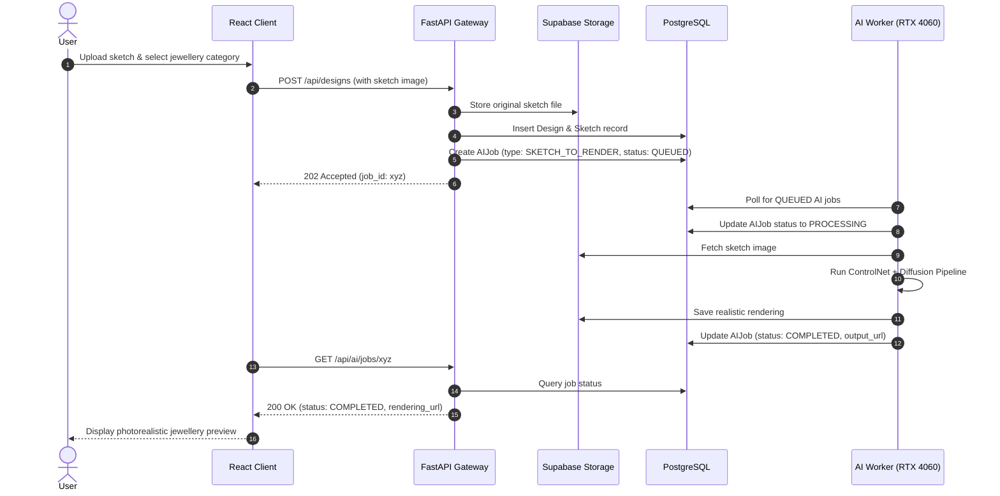

# JewelMind System Architecture

> **Document Version:** 1.0.0 (Phase 0 Foundation)  
> **Status:** Target Architecture Specification  

---

## 1. Architectural Overview
JewelMind is designed with a **decoupled, modular micro-service/worker topology** separating the interactive web application, data persistence layer, and heavy asynchronous AI/ML computation nodes.

```text
                         PUBLIC INTERNET
                                │
                                ▼
                     ┌─────────────────────┐
                     │  Cloudflare Pages   │
                     │  React + TypeScript │
                     └──────────┬──────────┘
                                │ HTTPS (REST / JSON)
                                ▼
                     ┌─────────────────────┐
                     │   FastAPI Backend   │
                     │     Application     │
                     └──────────┬──────────┘
                                │
                ┌───────────────┴───────────────┐
                │                               │
                ▼                               ▼
       ┌─────────────────┐             ┌─────────────────┐
       │    Supabase     │             │   AI Job Queue  │
       │ PostgreSQL DB   │             │   (DB-Backed)   │
       │ Object Storage  │             └────────┬────────┘
       └─────────────────┘                      │
                                       ┌────────┴────────┐
                                       │                 │
                                       ▼                 ▼
                                ┌─────────────┐   ┌─────────────┐
                                │  RTX 4060   │   │ HuggingFace │
                                │  AI Worker  │   │  ZeroGPU    │
                                └──────┬──────┘   └──────┬──────┘
                                       │                 │
                                       └────────┬────────┘
                                                ▼
                                           AI Result
                                                │
                                                ▼
                                       Supabase Storage / DB
```

---

## 2. Core Architectural Subsystems

### 2.1 Web Client (Frontend)
- **Framework:** React 19 + TypeScript + Vite + Tailwind CSS.
- **Responsibilities:**
  - User authentication and session management.
  - Interactive design management and sketch upload interface.
  - Asynchronous polling and visual state tracking for AI job progress (`QUEUED` $\rightarrow$ `PROCESSING` $\rightarrow$ `COMPLETED` / `FAILED`).
  - Rendering inspection (side-by-side sketch vs photorealistic generation).
  - Component bounding box overlays and interactive component counts.
  - Predictive analytics visualization (cost breakdowns, manufacturing time gauges, wastage charts).
  - Manufacturability warnings and risk factor displays.
  - Production order creation and workshop scheduling Gantt/timeline view.

### 2.2 Application Backend (FastAPI)
- **Framework:** Python FastAPI + Pydantic.
- **Responsibilities:**
  - RESTful API gateway handling authentication, authorization, and project CRUD.
  - Storage proxying / presigned URL issuance for sketch and asset uploads.
  - AI Job creation, status tracking, and result serialization.
  - Lightweight business rules and hybrid calculations.
  - Fast response times ($<100$ms) with non-blocking asynchronous job dispatch.

### 2.3 Data & Storage Tier
- **Relational Database:** PostgreSQL (hosted on Supabase free tier). Stores Users, Designs, Sketches, AIJobs, Components, Predictions, ProductionOrders, Workers, and Schedules.
- **Object Storage:** Supabase Object Storage (S3-compatible). Stores raw sketch images, preprocessed line drawings, rendered photorealistic outputs, component detection masks, and exported schedules.

### 2.4 Asynchronous AI Worker System
- **Worker Isolation:** Heavy compute operations (diffusion rendering, object detection training/inference, optimization) run strictly outside web request cycles.
- **Worker Types:**
  - **Local RTX 4060 Worker:** Primary development and high-throughput worker running locally via CUDA acceleration.
  - **Hugging Face Worker:** Secondary cloud worker operating on free-tier Spaces / ZeroGPU for remote live demonstrations.
- **Unified Worker Contract:**
  - `process_job(job_id, job_type, input_payload)`
  - Standardized JSON input/output schemas across all models.

---

## 3. End-to-End Information Flow



---

## 4. Scalability & Extensibility Principles
1. **Decoupled AI Compute:** Any ML model can be upgraded, swapped, or moved to cloud GPU infrastructure without modifying frontend UI components or database relations.
2. **Deterministic Fallbacks:** Wherever ML prediction is not strictly required (e.g. pure metal density arithmetic or standard labor hourly bases), hybrid deterministic rules ensure 100% reliable baseline estimations.
3. **Stateless Backend:** FastAPI backend instances maintain no local session state, allowing seamless horizontal scaling behind a reverse proxy.
