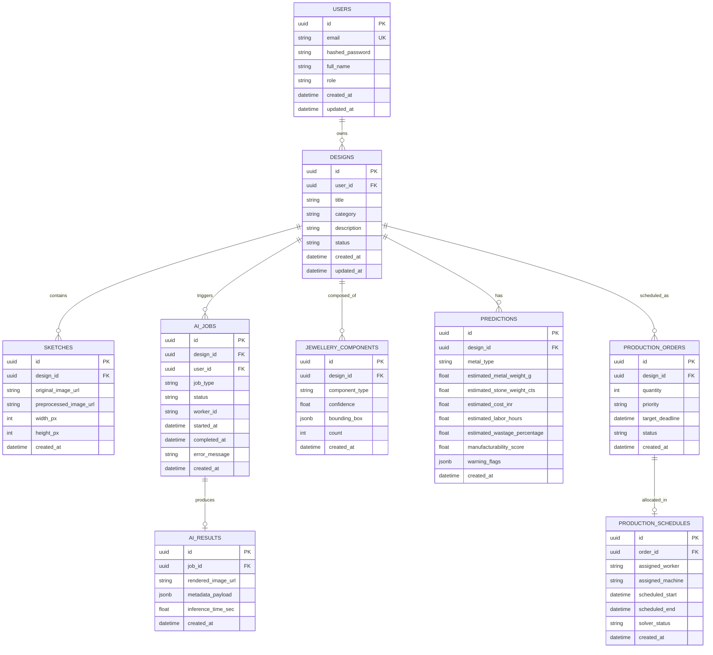

# Database Architecture & Entity Design

> **Document Version:** 1.0.0 (Phase 1 Foundation)  
> **Status:** Architectural Specification & Conceptual Data Model  

---

## 1. Overview
JewelMind utilizes a relational database architecture managed via **SQLAlchemy ORM** and **Alembic migrations**, targeting PostgreSQL (hosted on the Supabase free tier in production and compatible with standard local PostgreSQL instances).

---

## 2. Core Architectural Conventions

1. **Primary Keys:** Standard UUID v4 (`UUID(as_uuid=True)`) across all business entities.
2. **Timestamps:** Automatic `created_at` and `updated_at` UTC timestamps (`TimestampMixin`).
3. **Table Naming:** Lowercase plural with snake_case (`users`, `designs`, `sketches`, `ai_jobs`, `ai_results`, `jewellery_components`, `predictions`, `production_orders`, `production_schedules`).
4. **Foreign Keys:** Explicit relational constraints with cascading delete rules where parent entities dictate lifecycle (e.g. deleting a Design cascades to Sketches and Components).
5. **Enums & State Machines:** Strict enum values for status columns to ensure deterministic state transitions.

---

## 3. Entity Relationship Diagram (Conceptual)



---

## 4. Entity Lifecycle & State Machines

### 4.1 AI Job State Machine
```text
[QUEUED] ───► [PROCESSING] ───► [COMPLETED]
                   │
                   └───► [FAILED] (with error_message)
```

- **`QUEUED`:** Job created by FastAPI backend, awaiting worker pickup.
- **`PROCESSING`:** Worker leased the job, executing model inference (YOLO, Diffusion, XGBoost, OR-Tools).
- **`COMPLETED`:** Output artifact saved to Supabase Storage, result payload persisted in `ai_results`.
- **`FAILED`:** Inference failure or timeout; sanitized error logged.

---

## 5. Storage Tier Alignment
- **PostgreSQL:** Relational entities, bounding boxes, numeric predictions, schedules.
- **Object Storage (Supabase Storage):**
  - `sketches/original/`
  - `sketches/preprocessed/`
  - `renderings/photorealistic/`
  - `masks/detection/`
