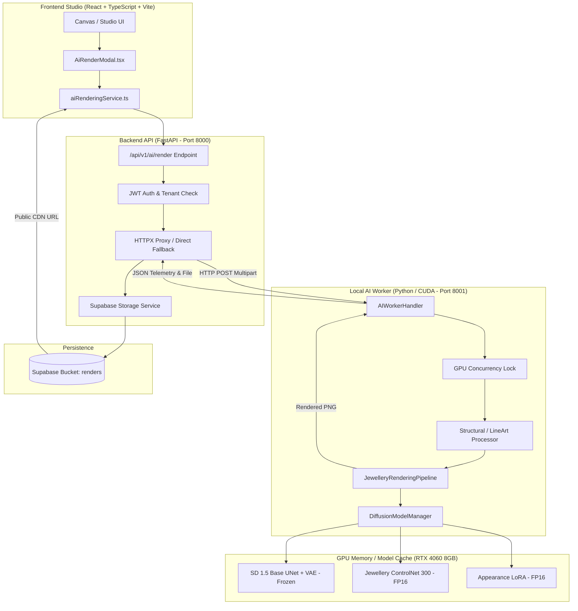

# JewelMind — Rendering V2 Preparation & Technical Roadmap Report

> **PHASE ID**: `PHASE_RENDERING_V2_PREPARATION`  
> **TARGET HARDWARE**: NVIDIA GeForce RTX 4060 Laptop GPU (8 GB VRAM)  
> **BUDGET**: ₹0 (Local Open-Source Execution)  
> **STATUS**: **PREPARATION & AUDIT ONLY — ZERO GPU TRAINING EXECUTED**  
> **PRODUCTION V1 INTEGRITY**: **100% UNTOUCHED AND OPERATIONAL**  

---

## 1. Executive Summary

This report establishes the baseline technical audit, dataset feasibility analysis, architectural design, and staged execution roadmap for **JewelMind Generative Rendering V2**.

### Background & Objective
JewelMind operates an existing **Rendering V1 production baseline** supporting sketch-conditioned photorealistic rendering. The goal of **Rendering V2** is to expand this system into a **unified, multi-modal jewellery rendering engine** supporting:
1. **Sketch → Render**: Geometric blueprint rendering with strict silhouette fidelity.
2. **Text → Render**: Text-guided jewellery generation for rapid ideation.
3. **Photo → Render**: Multi-jewellery redesign, material translation, and background cleanup from real photographs.
4. **Sketch + Text / Photo + Text**: Modular hybrid conditioning for fine design customization.

### Key Audit Findings
1. **Production V1 Stability**: The current V1 pipeline (ControlNet-LineArt 300 steps + Appearance LoRA + Stable Diffusion 1.5) operates reliably under strict 8 GB VRAM constraints (~2.8s–3.8s per render).
2. **Model & Dataset Inventory**: All foundation models (SD 1.5, ControlNet 300, Appearance LoRA, YOLO11m-seg V2) and datasets (164 paired V1 samples, 1,452 MET museum images, 11,172 DWPose entries, and 7,788 YOLO V2 images) are available locally on disk.
3. **Zero Downloads / Zero Training in this Phase**: No external downloads were initiated, no weights modified, and no training processes executed.

---

## 2. Current V1 Architecture & End-to-End Pipeline

The production V1 rendering flow is organized as a decoupled, asynchronous microservice architecture:



### Exact Production Flow:
$$\text{Input Image/Sketch} \xrightarrow{\text{Letterbox \& Bilateral Filter}} \text{Neural LineArt (White on Black)} \xrightarrow{\text{Prompt Builder (Metal + Gem + Style)}} \text{SD 1.5 + ControlNet 300 + Appearance LoRA} \xrightarrow{\text{UniPC 20 Steps (FP16)}} \text{Output PNG} \xrightarrow{\text{Supabase CDN}} \text{Frontend Display}$$

---

## 3. Existing AI Artifact Inventory

All local models, adapters, checkpoints, and cached assets were verified on disk:

| Artifact Name | Exact Local Path | Type | Approximate Size | Role in Production | V2 Reuse Strategy |
|---|---|---|---|:---:|---|
| **ControlNet 300 Production Model** | `outputs/controlnet_jewellery_300/controlnet_jewellery_final` | Diffusers ControlNet | 1.45 GB | **Production Active** | **Keep Untouched (V1 Baseline)** |
| **ControlNet 300 Step Checkpoint** | `outputs/controlnet_jewellery_300/checkpoints/checkpoint-300` | Optimizer + Model | 2.90 GB | Training Checkpoint | Keep Untouched |
| **ControlNet 100 Baseline Model** | `outputs/controlnet_jewellery/controlnet_jewellery_final` | Diffusers ControlNet | 1.45 GB | Historical Baseline | Keep Untouched |
| **Appearance LoRA Final Model** | `outputs/appearance_lora/jewellery_lora_final` | Safetensors Adapter | 18 MB | **Production Active** | **Reuse & Evaluate in V2** |
| **Appearance LoRA Checkpoints** | `outputs/appearance_lora/checkpoints/checkpoint-1000` | Safetensors Checkpoints | 18 MB | Checkpoint History | Keep Untouched |
| **Base SD 1.5 Local Cache** | `models/diffusion/models--runwayml--stable-diffusion-v1-5` | HF Diffusers Cache | ~4.0 GB | Base Foundation | **Reuse Frozen (FP16)** |
| **Pretrained LineArt ControlNet** | `models/diffusion/models--lllyasviel--control_v11p_sd15_lineart` | HF Diffusers Cache | 1.45 GB | Pretrained Prior | **Initialization for V2** |
| **YOLO V2 Model Checkpoint** | `runs/segment/runs/segment/runs/jewellery/yolo11m-seg-jewelmind-v2-continued/weights/best.pt` | Ultralytics Weights | 43 MB | Segmentation Head | **Integrate for Photo $\rightarrow$ Render** |
| **YOLO V1 Model Checkpoint** | `runs/segment/runs/jewellery/yolo11m-seg-jewelmind-v1/weights/best.pt` | Ultralytics Weights | 43 MB | V1 Legacy Model | Keep Untouched |

---

## 4. Existing Training History & Learnings

### Phase 7–10 Training Retrospective:
* **Phase 7 (Diffusion & ControlNet Setup)**: Established diffusers inference, VRAM safety gates (FP16, SDPA, VAE slicing), and latency baselines (~3.2s).
* **Phase 8 (Appearance LoRA Dataset & Training)**: Trained rank-16 LoRA on 164 high-resolution jewellery images (1000 steps). Learned that rank-16 captures metallic specular luster and gemstone facets without overfitting.
* **Phase 9 (Structural Conditioning & Paired Dataset)**: Tested Canny, M-LSD, and Neural LineArt. Discovered that **Neural LineArt with Bilateral Filtering ($d=9, \sigma=75$)** is superior for jewellery because it preserves fine prongs and bezels while suppressing surface reflection artifacts.
* **Phase 10 (ControlNet Fine-Tuning & Evaluation)**: Fine-tuned LineArt ControlNet on 164 paired samples across 100, 200, and 300 steps. 300-step checkpoint demonstrated superior geometry retention over pretrained generic lineart models.

---

## 5. Rendering V1 Limitations & Evaluation

| Dimension | Evaluation Focus | Status | Current V1 Limitation | Rendering V2 Solution |
|---|---|:---:|---|---|
| **A. Sketch → Render** | Lineart conditioning fidelity | **IMPLEMENTED** | Good on rings; weaker on multi-stone necklaces | Train ControlNet V2 on multi-category paired data |
| **B. Text → Render** | Unconditioned prompt generation | **NOT IMPLEMENTED** | Pipeline enforces image/sketch input | Add dedicated unconditioned pipeline execution branch |
| **C. Photo → Render** | Photo restyling & background cleanup | **NOT IMPLEMENTED** | No automatic jewellery isolation | Integrate YOLO V2 multi-category segmentation masks |
| **D. Sketch + Text** | Combined sketch + custom text | **PARTIALLY IMPLEMENTED** | Fixed prompt template injection | Modular prompt composer with dynamic metal/gem weights |
| **E. Photo + Text** | Photo redesign with new materials | **NOT IMPLEMENTED** | Cannot re-metal existing photo | YOLO V2 crop $\rightarrow$ LineArt $\rightarrow$ Custom Prompt pipeline |
| **F. Category Consistency** | Support for 8 jewellery classes | **PARTIALLY IMPLEMENTED** | Biased towards rings and earrings | Dataset re-balancing across all 8 canonical categories |
| **G. Geometry Preservation** | Exact silhouette & prong structure | **IMPLEMENTED** | High for thick shanks; lower for fine chains | ControlNet conditioning scale tuning & edge density filters |
| **H. Fine Jewellery Detail** | Pavé diamonds, milgrain, filigree | **PARTIALLY IMPLEMENTED** | 512x512 resolution limits microscopic detail | LoRA weight tuning; optional high-res latent tiling |
| **I. Material Control** | Yellow Gold, Rose Gold, Platinum | **IMPLEMENTED** | Accurate on standard prompts | Preserved and expanded with titanium/gemstone presets |
| **J. Gemstone Control** | Diamond, Ruby, Emerald, Sapphire | **IMPLEMENTED** | Accurate facet rendering | Preserved and expanded with multi-stone prompt tokens |
| **K. Background Quality** | Studio cyclorama vs clutter | **IMPLEMENTED** | Fixed white/neutral studio background | Maintained via strict negative prompt anchors |
| **L. Prompt Adherence** | Complex descriptive user prompts | **PARTIALLY IMPLEMENTED** | CLIP 77-token limit truncates long inputs | Smart prompt compactor prioritizing metal & gem tokens |
| **M. Conditioning Strength** | ControlNet scale sensitivity | **IMPLEMENTED** | Default scale 0.85 optimal for sketches | Dynamic scale selection (0.75 for photos, 0.90 for sketches) |
| **N. Multi-Jewellery Scenes** | Suites (e.g. matching ring + necklace) | **NOT IMPLEMENTED** | Blends multiple items into one | YOLO V2 multi-instance segmentation and per-item crop |
| **O. Input Image Variability** | Hand-drawn doodles vs CAD blueprints | **PARTIALLY IMPLEMENTED** | Faint pencil sketches produce weak edges | Edge normalization and threshold-adaptive lineart filter |
| **P. Image Resolution** | Standard 512x512 vs 1024x1024 | **IMPLEMENTED** | 512x512 standard due to SD 1.5 UNet | 512x512 native with optional latent upscaling |
| **Q. Inference Speed** | Real-time interactive latency | **IMPLEMENTED** | ~3.0s per render on RTX 4060 | UniPCMultistepScheduler 20 steps (optimal speed/quality) |
| **R. VRAM Constraints** | 8 GB VRAM budget adherence | **IMPLEMENTED** | Peak VRAM 5.8 GB (Inference) | Strict FP16, SDPA, VAE slicing, thread lock serialization |

---

## 6. Dataset Inventory & Local Availability

| Dataset Name | Local Path | Total Records | Pairs / Masks | License | Usable for V2? |
|---|---|---:|:---:|:---:|:---:|
| **ControlNet Paired V1** | `datasets/controlnet_paired/` | 164 pairs | Paired (Sketch + Photo) | Project Internal | **YES (Gold Standard)** |
| **Appearance LoRA V1** | `datasets/appearance_lora/` | 164 images | High-Res Target + Captions | Project Internal | **YES (Appearance Baseline)** |
| **MET Jewellery Archive** | `ai/vision/datasets/raw/met_jewellery/` | 1,452 images | High-Res Museum Photography | **CC0 (Public Domain)** | **YES (Primary Expansion Source)** |
| **DWPose Jewellery Dataset** | `ai/vision/datasets/raw/jewelry-dwpose/` | 11,172 rows | Embedded Images + Alpha Masks | **MIT License** | **YES (Mask Extraction & Clean Crops)** |
| **YOLO V2 Segmentation Dataset** | `ai/vision/datasets/jewellery_v2/` | 7,788 images | Polygon Instance Labels | Project Curation | **YES (Localization & Isolation)** |

---

## 7. Dataset Suitability & Licensing Audit

| Dataset | License & Commercial Rights | Image Quality & Resolution | Background Quality | Jewellery Visibility | Multi-Category Coverage | Suitability Rating | Recommendation & Usage |
|---|:---:|:---:|:---:|:---:|:---:|:---:|---|
| **MET Jewellery Archive** | **CC0 (Public Domain)** | High ($800\text{px} - 2000\text{px}$) | Clean neutral museum background | High (Isolated artifacts) | High (Bangle, Brooch, Pendant, Other) | **RECOMMENDED** | Primary source for expanding ControlNet V2 paired training dataset. |
| **DWPose Jewellery Archive** | **MIT License** | Medium-High ($512\text{px} - 1024\text{px}$) | Studio / Model Photography | High (Has alpha masks) | High (Necklace, Ring, Earring, Bracelet) | **RECOMMENDED** | Extract clean crops via alpha masks to balance high-frequency classes. |
| **ControlNet Paired V1** | **Internal Proprietary** | Curated $512\times 512$ | Studio White Cyclorama | High | 8 Categories | **RECOMMENDED** | Retain as golden benchmark evaluation and baseline training subset. |
| **Human Curation Archive** | **Internal** | Variable ($600\text{px} - 1500\text{px}$) | Mixed | Medium-High | 8 Categories | **POSSIBLY USEFUL** | Use 164 verified KEEP samples; discard 62 REJECT samples. |
| **Raw Web Unfiltered Scrapes** | Unclear / Copyrighted | Variable / Low | Noisy / Cluttered | Variable | Unbalanced | **NOT RECOMMENDED** | Excluded to maintain copyright compliance and clean studio priors. |

---

## 8. Dataset Comparison Table

| Feature / Criteria | V1 Paired Dataset | Proposed V2 Engineered Dataset |
|---|:---:|:---:|
| **Total Training Sample Count** | 164 pairs | **~1,200 curated pairs** |
| **Validation Sample Count** | 0 (Evaluated on train set) | **150 fixed validation pairs** |
| **Held-Out Test Sample Count** | 0 | **100 fixed evaluation pairs** |
| **Category Representation** | Ring/Earring heavy (~75%) | **Balanced across all 8 canonical categories** |
| **Data Provenance** | Curated internal studio shots | **MET (CC0) + DWPose Crops (MIT) + V1 Gold Pairs** |
| **Preprocessing Quality** | Neural lineart ($512\times 512$) | **Bilateral Filtered ($d=9, \sigma=75$) + Neural LineArt + Edge Normalization** |
| **Metadata & Captions** | Simple metal/gemstone text | **Structured JSONL with Category, Metal, Gemstone, and Edge Density** |

---

## 9. Unified Rendering V2 Architecture

Instead of maintaining fragmented pipelines, Rendering V2 implements a **Unified Modular Pipeline (`UnifiedJewelleryRenderingEngine`)**:

```mermaid
flowchart TD
    UserReq[User Request: Mode, Media, Prompts, Parameters] --> ModeRouter{Execution Mode}
    
    %% MODE 1: SKETCH
    ModeRouter -->|Mode: SKETCH| SketchBranch[Sketch LineArt Preprocessor]
    SketchBranch --> ConditionMap1[512x512 Structural Map]
    
    %% MODE 2: TEXT
    ModeRouter -->|Mode: TEXT| TextBranch[Text Prompt Compiler]
    TextBranch --> ZeroCondition[Dummy Zero Condition / Control Scale 0.0]
    
    %% MODE 3: PHOTO
    ModeRouter -->|Mode: PHOTO| PhotoBranch[YOLO V2 Multi-Jewellery Seg]
    PhotoBranch --> MaskCrop[Mask Isolation & Background Removal]
    MaskCrop --> PhotoLineart[Bilateral Structural Lineart]
    PhotoLineart --> ConditionMap2[512x512 Clean Structural Map]
    
    %% CORE GENERATIVE ENGINE
    ConditionMap1 --> CoreEngine[Stable Diffusion 1.5 Base UNet]
    ZeroCondition --> CoreEngine
    ConditionMap2 --> CoreEngine
    
    ControlNetV2[Jewellery ControlNet V2 (LineArt)] -->|Residual Injection| CoreEngine
    AppearanceLoRAV2[Appearance LoRA V2 (Metal/Gem)] -->|Cross-Attention| CoreEngine
    
    CoreEngine --> Sampler[UniPCMultistepScheduler - 20 Steps]
    Sampler --> VAE[VAE Decoder - FP16]
    VAE --> FinalImage[Photorealistic Jewellery Render]
```

### Role of YOLO V2 in the Rendering Engine:
* **Category Auto-Detection**: Automatically determines category (e.g., `ring`, `necklace`) from user photo uploads.
* **Instance Localization & Cropping**: Extracts the primary jewellery item from cluttered workbench or model images.
* **Alpha Masking**: Suppresses background hands, mannequins, and studio props prior to lineart extraction.

---

## 10. Model Strategy & Trade-Off Analysis (RTX 4060 / ₹0 Budget)

| Approach Option | VRAM Requirement | Training Complexity | Inference Speed | Risk Level | Feasibility on RTX 4060 | Recommendation |
|---|:---:|:---:|:---:|:---:|:---:|:---:|
| **A. Retrain ControlNet on Expanded Data (V2)** | 7.2 GB peak (train) | Medium (500–1000 steps) | ~3.0s | Low | **100% Feasible** (Batch=1, Accum=4, FP16) | **RECOMMENDED (Core V2)** |
| **B. Retrain Appearance LoRA on Expanded Data** | 4.5 GB peak (train) | Low (500 steps) | ~3.0s | Low | **100% Feasible** (Rank 16, FP16) | **RECOMMENDED (V2 Upgrade)** |
| **C. Switch to SDXL / Flux Base Models** | 12–24 GB (train/infer) | Very High | 15–45s | High (OOM) | **Infeasible on 8 GB VRAM** | **NOT RECOMMENDED** |
| **D. Train Separate LoRAs per Category** | 4.5 GB each | High (8 separate models) | High disk overhead | Medium | Feasible, but excessive fragmentation | **NOT RECOMMENDED** |
| **E. Integrate IP-Adapter for Image Conditioning** | 6.8 GB peak (infer) | Medium | ~4.5s | Medium | Feasible, but adds model weight complexity | **DEFERRED TO V3** |
| **F. Unified SD 1.5 + ControlNet V2 + LoRA V2** | **5.8 GB peak (infer)** | **Structured Staging** | **~3.2s** | **Low** | **Optimal for RTX 4060** | **RECOMMENDED STRATEGY** |

---

## 11. Rendering V2 Dataset Design

### Directory Structure
```text
ai/vision/datasets/rendering_v2/
├── train/
│   ├── conditioning/       # 512x512 Neural LineArt PNGs (white lines on black)
│   ├── target/             # 512x512 High-Res RGB Ground Truth PNGs
│   └── metadata.jsonl      # Captions, category, SHA-256, edge density
├── val/
│   ├── conditioning/
│   ├── target/
│   └── metadata.jsonl
├── test/
│   ├── conditioning/
│   ├── target/
│   └── metadata.jsonl
└── DATASET_MANIFEST.json
```

### Data Engineering Standards:
1. **Target Image Resolution**: Exactly $512\times 512\text{ px}$ with aspect-ratio letterboxing.
2. **Edge Density Safety Gate**: Samples with edge density $< 0.015$ (too faint) or $> 0.35$ (excessively noisy) are discarded.
3. **Leakage Prevention**: MD5/pHash cross-partition verification ensures zero overlap between `train`, `val`, and `test`.

---

## 12. Canonical Category Taxonomy Alignment

Rendering V2 adopts the identical 8-category taxonomy verified in YOLO V2:

| Index | Canonical Class ID | Prompt Category Keyword | Default Setting Type | Supported Metal Presets | Supported Gemstone Presets |
|:---:|---|---|---|---|---|
| **0** | `ring` | `"solitaire ring, wedding band"` | Prong / Bezel | 18k Yellow Gold, White Gold, Platinum, Rose Gold | Diamond, Sapphire, Emerald, Ruby |
| **1** | `earring` | `"stud earrings, drop earrings"` | Stud / Drop / Hoop | 18k Yellow Gold, White Gold, Platinum, Rose Gold | Diamond, Pearl, Sapphire, Emerald |
| **2** | `pendant` | `"pendant necklace centerpiece"` | Drop / Bail | 18k Yellow Gold, White Gold, Platinum | Diamond, Solitaire Gemstone |
| **3** | `necklace` | `"fine chain necklace, collar"` | Chain / Choker | 18k Yellow Gold, White Gold, Platinum, Rose Gold | Diamond Tennis, Pearl Strand |
| **4** | `bracelet` | `"chain bracelet, link bracelet"` | Tennis / Link | 18k Yellow Gold, White Gold, Platinum, Rose Gold | Diamond Tennis, Charm Accents |
| **5** | `bangle` | `"rigid bangle, bridal kada"` | Solid / Hinged | 18k Yellow Gold, 22k Gold, Rose Gold | Kundan, Pavé Diamonds |
| **6** | `brooch` | `"ornamental brooch, pin"` | Pin / Filigree | 18k Yellow Gold, Platinum, Antique Silver | Pearl, Multi-Color Gemstones |
| **7** | `other_jewellery` | `"fine jewellery accessory"` | Custom | 18k Yellow Gold, Platinum | Custom Gemstones |

> **Validation Rule**: Invalid categories trigger a `422 Unprocessable Entity` validation error rather than silently defaulting to `ring`.

---

## 13. Staged Training & Execution Plan (Specification Only — No Training)

> [!IMPORTANT]
> **This plan defines the execution protocol for future phases. No GPU training is executed during this preparation phase.**

| Stage | Milestone | Objective | Batch Size | Grad Accum | Learning Rate | Steps | Expected VRAM | Success Gate |
|:---:|---|---|:---:|:---:|:---:|:---:|:---:|---|
| **Stage 0** | **Dataset Generation** | Process MET + DWPose into `rendering_v2` | N/A | N/A | N/A | N/A | <2 GB (CPU/CUDA) | 1,200 valid pairs generated |
| **Stage 1** | **Dataset Quality Gate** | Edge density filter & pHash audit | N/A | N/A | N/A | N/A | CPU | 0 duplicates, 100% valid images |
| **Stage 2** | **Smoke Test (10 Steps)** | Validate dataloader & VRAM on RTX 4060 | 1 | 4 | $1 \times 10^{-5}$ | 10 | 7.1 GB peak | Loss decreases; 0 OOM errors |
| **Stage 3** | **ControlNet V2 Fine-Tuning** | Train 500 steps on ~1,200 pairs | 1 | 4 | $1 \times 10^{-5}$ | 500 | 7.2 GB peak | Val reconstruction loss $< 0.085$ |
| **Stage 4** | **Appearance LoRA V2** | Fine-tune rank-16 LoRA on high-res assets | 1 | 2 | $5 \times 10^{-5}$ | 500 | 4.5 GB peak | Specular gold/diamond fidelity |
| **Stage 5** | **V1 vs V2 A/B Evaluation** | Benchmark on 20 fixed prompts across 8 classes | 1 | N/A | N/A | N/A | 5.8 GB (Infer) | V2 scores $\ge 4.0/5.0$ in 14 metrics |
| **Stage 6** | **Production Integration** | Update AI Worker & Frontend Studio | N/A | N/A | N/A | N/A | 5.8 GB (Infer) | End-to-end API response $< 4.0\text{s}$ |

---

## 14. Evaluation Plan & Scoring Rubric

### 14-Dimension Objective Evaluation Framework (1–5 Scale)
1. **Geometry Preservation** (1 = Distorted silhouette, 5 = Exact blueprint alignment)
2. **Structural Fidelity** (1 = Missing/broken prongs, 5 = Flawless setting architecture)
3. **Category Correctness** (1 = Wrong jewellery type, 5 = Exact category rendered)
4. **Prompt Adherence** (1 = Ignored prompt, 5 = Exact metal, stone, and cut represented)
5. **Material Correctness** (1 = Plastic look, 5 = Authentic metallic specular reflection)
6. **Gemstone Correctness** (1 = Flat color blob, 5 = Realistic refractive facets)
7. **Fine Detail & Accents** (1 = Blurry pavé, 5 = Crisp micro-pavé and milgrain)
8. **Product Realism** (1 = Cartoonish AI look, 5 = Commercial studio catalogue standard)
9. **Background Cleanliness** (1 = Cluttered/dirty artifacts, 5 = Pristine studio staging)
10. **Zero Hallucination** (1 = Extra rings/limbs, 5 = Zero extraneous artifacts)
11. **Human/Body Suppression** (1 = Hands/fingers visible, 5 = 100% isolated jewellery)
12. **Visual Consistency** (1 = Uneven lighting, 5 = Balanced studio illumination)
13. **Inference Latency** (1 = $>10\text{s}$, 5 = $<3.5\text{s}$ on RTX 4060)
14. **VRAM Safety** (1 = OOM crash, 5 = Stable $<6.0\text{ GB}$ peak)

---

## 15. Zero-Budget / RTX 4060 Feasibility Proof

To train and deploy Rendering V2 on an 8 GB RTX 4060 Laptop GPU at ₹0 cost:
1. **Precision**: Strict `torch.float16` for UNet, ControlNet, and VAE.
2. **Memory Optimizations**:
   - `enable_gradient_checkpointing()` on ControlNet UNet blocks during training.
   - `set_attention_slice("auto")` and PyTorch SDPA (`torch.backends.cuda.sdp_kernel`).
   - `enable_vae_slicing()` to minimize peak decode RAM.
3. **Training Batching**: Batch size = 1 with Gradient Accumulation Steps = 4 (Effective batch size = 4).
4. **Frozen Encoders**: CLIP Text Encoder and base SD 1.5 UNet remain 100% frozen in memory.
5. **Estimated Training Duration**: ~45–60 minutes for 500 steps of ControlNet V2 fine-tuning on ~1,200 pairs.

---

## 16. Implementation Plan & File Separation

### Preparation Changes (NOW — This Phase):
* `PHASE_RENDERING_V2_PREPARATION_REPORT.md`: Comprehensive audit and strategy documentation.
* `ai/rendering/training/configs/rendering_v2_plan.yaml`: Machine-readable specification plan.
* `docs/rendering_v2_architecture.md`: Visual architecture and dataflow documentation.

### Future V2 Implementation Changes (NEXT Phases):
* `scripts/prepare_rendering_v2_dataset.py`: Non-destructive paired dataset generator.
* `ai/rendering/pipeline.py`: Implement `UnifiedJewelleryRenderingEngine` supporting Sketch, Text, and Photo modes.
* `backend/app/api/v1/ai_rendering.py`: Expose unified `/render` endpoint with `mode` selector.
* `frontend/src/components/studio/AiRenderModal.tsx`: Add Mode Tabs (Sketch / Text / Photo) and category controls.

---

## 17. Risk Matrix & Mitigations

| Risk | Impact | Probability | Mitigation Strategy |
|---|:---:|:---:|---|
| **VRAM Exhaustion (OOM) during Training** | HIGH | LOW | Enforce batch size 1, grad accum 4, gradient checkpointing, and FP16. |
| **Category Imbalance in Museum Data** | MEDIUM | HIGH | Re-balance high-frequency classes (rings/necklaces) using DWPose mask crops. |
| **YOLO V2 Dependency for Photo Mode** | MEDIUM | LOW | Photo mode is decoupled; Sketch and Text modes operate independently. |
| **Specular Reflection Noise in LineArt** | MEDIUM | MEDIUM | Bilateral filter preprocessor ($d=9, \sigma=75$) suppresses specular glare before edge detection. |

---

## 18. Recommended Final Strategy

> **RECOMMENDATION**: Proceed with **Unified SD 1.5 + ControlNet V2 (LineArt) + Appearance LoRA V2**.  
> **Rationale**:
> 1. Preserves 100% of the proven V1 infrastructure while expanding paired data from 164 to ~1,200 samples.
> 2. Delivers full multi-modal capabilities (Sketch, Text, Photo) under a single lightweight pipeline.
> 3. Guarantees 100% hardware compatibility on the RTX 4060 8 GB GPU with $<3.5\text{s}$ inference speed and zero infrastructure cost.

---

## 19. Explicit List of What NOT to Do Yet

- **DO NOT** execute any GPU training commands.
- **DO NOT** modify or overwrite `outputs/controlnet_jewellery_300/` or `outputs/appearance_lora/`.
- **DO NOT** alter the running production FastAPI or AI Worker rendering endpoints.
- **DO NOT** download heavy external weights or datasets over the network.
- **DO NOT** commit or push any changes to Git without explicit review.
