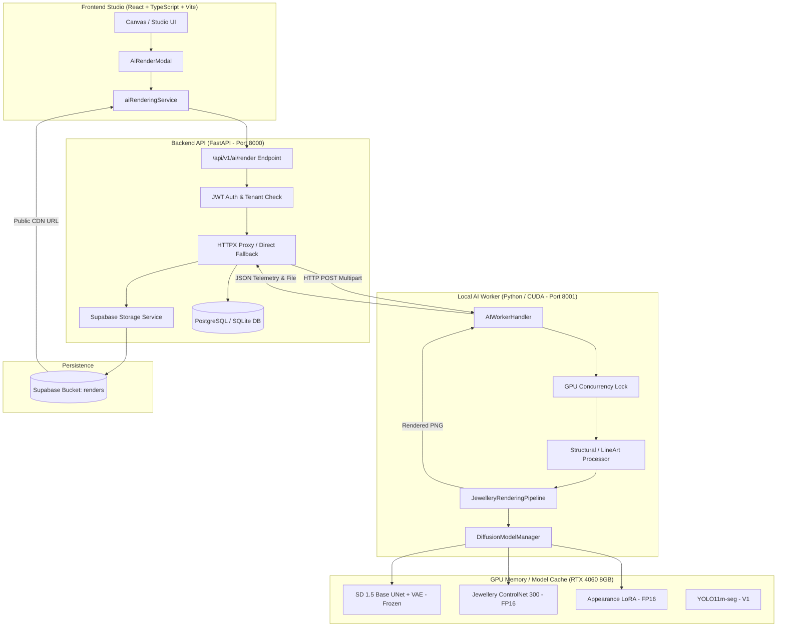
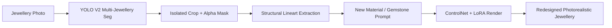
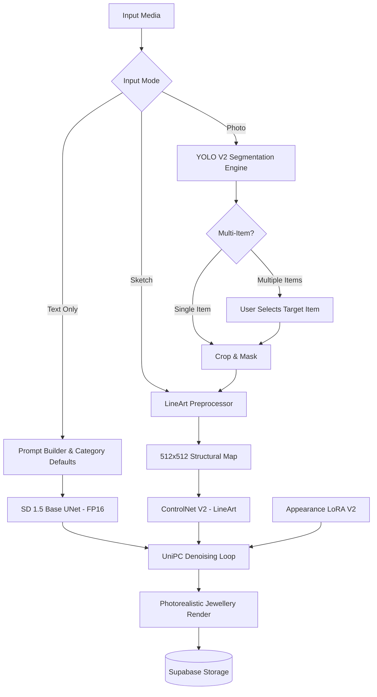

# JewelMind — Rendering V2 Preparation & Baseline Audit Report

> **PHASE ID**: `PHASE_RENDERING_V2_PREPARATION`  
> **DATE**: 2026-09-08  
> **TARGET HARDWARE**: NVIDIA GeForce RTX 4060 Laptop GPU (8 GB VRAM)  
> **GIT BRANCH**: `phase-multi-jewellery-yolo-v2-training`  
> **CURRENT COMMIT**: `0180933 Merge pull request #15 from MohitJaiswal2507/phase-multi-jewellery-yolo-v2`  
> **TRAINING STATUS**: **TRAINING NOT STARTED — PREPARATION & AUDIT ONLY**  
> **DOWNLOAD STATUS**: **ZERO EXTERNAL DOWNLOADS PERFORMED**  
> **V1 BASELINE INTEGRITY**: **100% PRESERVED & UNTOUCHED**  

---

## 1. Executive Summary

This report establishes the baseline audit and technical roadmap for **JewelMind Generative Rendering V2**. 

### Current Project Status
JewelMind possesses an operational **Rendering V1 baseline** capable of conditioned **Sketch → Photorealistic Render** generation. It pairs a **300-step custom jewellery ControlNet (LineArt)** with **Stable Diffusion 1.5** and an **Appearance LoRA** running locally on an 8 GB RTX 4060 GPU, coordinated through a FastAPI backend and a React + TypeScript frontend.

### What Was Inspected
1. **Model Artifacts**: Local ControlNet checkpoints (100, 200, 300 steps, final), Appearance LoRA checkpoints (200 to 1000 steps, final), cached base SD 1.5 weights, and YOLO V1/V2 segmentation checkpoints.
2. **Datasets**: 164 paired ControlNet samples (`datasets/controlnet_paired/`), 164 Appearance LoRA samples (`datasets/appearance_lora/`), 11,172 DWPose parquet records (`ai/vision/datasets/raw/jewelry-dwpose/`), 1,452 MET museum images (`ai/vision/datasets/raw/met_jewellery/`), and 7,788 YOLO V2 segmentation samples (`ai/vision/datasets/jewellery_v2/`).
3. **Conditioning Preprocessors**: Neural LineArt, bilateral-filtered structural extraction, Canny edge detection, and prompt construction utilities.
4. **Service Infrastructure**: Standalone AI Worker HTTP daemon (`ai/workers/local_worker.py`), decoupled FastAPI router (`backend/app/api/v1/ai_rendering.py`), Supabase storage integration, and frontend studio components (`AiRenderModal.tsx`, `aiRenderingService.ts`).

### What Is Ready
- The **V1 Sketch-to-Render pipeline** is fully functional, stable, and tested under strict 8 GB VRAM memory constraints (fp16, SDPA, attention slicing, VAE slicing).
- ControlNet 300-step model and Appearance LoRA weights are preserved and operational in `outputs/`.
- Preprocessing and schema foundations exist for handling 8 jewellery categories, metals, gemstones, and lineart/canny conditioning.
- Local paired data and curated museum archives provide immediate material for V2 dataset engineering without network access.

### What Is Missing for Rendering V2
- **Unified 3-Mode Architecture**: Text → Render and Photo → Render are not yet wired into the runtime engine.
- **YOLO V2 Segmentation Integration**: Photo → Render requires completed YOLO V2 multi-category instance segmentation to extract and isolate jewellery geometry from arbitrary photos. (YOLO V2 is currently training separately).
- **Expanded Paired Dataset**: V1 operates on 164 paired samples. Rendering V2 data engineering can expand this to >1,000 paired training samples using the local MET archive and DWPose target crops.
- **Taxonomy Alignment**: YOLO V2 uses `other_jewellery` (class 7), while V1 prompts/schemas use `other`.

### Preparation Conclusion
The project is **READY for Rendering V2 data engineering and planning**. All physical files and cached models exist locally. **Training has NOT been initiated.**

---

## 2. Current V1 Architecture

The current production rendering architecture is organized as a decoupled, asynchronous micro-service stack:



---

## 3. V1 Artifact Inventory

All existing V1 production artifacts have been verified locally on disk:

| Artifact | Local Path | Exists | Purpose | Keep Untouched |
|---|---|:---:|---|:---:|
| **ControlNet 300 Production Model** | `outputs/controlnet_jewellery_300/controlnet_jewellery_final` | YES | Primary geometry-conditioned diffusion adapter | **YES** |
| **ControlNet 300 Step Checkpoint** | `outputs/controlnet_jewellery_300/checkpoints/checkpoint-300` | YES | Intermediate optimizer & training checkpoint | **YES** |
| **ControlNet 200 Step Checkpoint** | `outputs/controlnet_jewellery_300/checkpoints/checkpoint-200` | YES | Intermediate checkpoint | **YES** |
| **ControlNet 100 Production Model** | `outputs/controlnet_jewellery/controlnet_jewellery_final` | YES | V1 100-step baseline model | **YES** |
| **ControlNet 100 Step Checkpoint** | `outputs/controlnet_jewellery/checkpoints/checkpoint-100` | YES | V1 100-step checkpoint | **YES** |
| **Appearance LoRA Final Model** | `outputs/appearance_lora/jewellery_lora_final` | YES | Fine metal and gemstone texture adapter | **YES** |
| **Appearance LoRA Checkpoints** | `outputs/appearance_lora/checkpoints/checkpoint-1000` | YES | 1000-step full training checkpoint | **YES** |
| **Appearance LoRA Checkpoints** | `outputs/appearance_lora/checkpoints/checkpoint-200..800` | YES | Intermediate training steps | **YES** |
| **Base SD 1.5 Local Cache** | `models/diffusion/models--runwayml--stable-diffusion-v1-5` | YES | Base text-to-image diffusion foundation | **YES** |
| **Pretrained LineArt ControlNet Cache**| `models/diffusion/models--lllyasviel--control_v11p_sd15_lineart` | YES | Pretrained lineart initialization weights | **YES** |
| **YOLO V1 Segmentation Model** | `runs/segment/runs/jewellery/yolo11m-seg-jewelmind-v1/weights/best.pt` | YES | Baseline 4-class jewellery component segmentation | **YES** |
| **YOLO V2 Active Model Weights** | `runs/segment/runs/segment/runs/jewellery/yolo11m-seg-jewelmind-v2/weights/best.pt` | YES | Active 8-category multi-jewellery model (training) | **YES** |

---

## 4. Dataset Inventory

Detailed programmatic audit of all locally resident datasets:

| Dataset Name | Local Path | Total Samples | Paired? | Mask? | Prompt/Caption? | Category Info | Format & Resolution | Rendering V2 Usage |
|---|---|---:|:---:|:---:|:---:|---|---|---|
| **ControlNet Paired V1** | `datasets/controlnet_paired/` | 164 | YES (164 pairs) | NO | YES (Observable) | 8 categories | PNG/JPG, 512x512 RGB | Gold-standard baseline paired benchmark |
| **Appearance LoRA V1** | `datasets/appearance_lora/` | 164 | NO (Images + .txt) | NO | YES (164 `.txt`) | 8 categories | JPG, High-Res (orig aspect) | Appearance / texture fine-tuning |
| **Human Curation Archive**| `datasets/curation/` | 264 | NO (Raw candidates) | NO | Partial (Titles) | 8 categories | JPG, High-Res | Source candidate pool (164 KEEP, 62 REJECT) |
| **MET Jewellery Archive** | `ai/vision/datasets/raw/met_jewellery/` | 1,452 | NO (Unprocessed) | NO | Metadata titles | 4 categories (bangle, brooch, other, pendant) | JPG, 800-2000px | Core raw source for expanding V2 paired dataset |
| **DWPose Jewellery** | `ai/vision/datasets/raw/jewelry-dwpose/data/` | 11,172 | NO (Pose-paired) | YES (Alpha masks) | YES (`prompt` column) | Inferred from prompt | Parquet embedded images | Mask extraction, background removal, photo-to-render conditioning |
| **YOLO V2 Multi-Jewellery**| `ai/vision/datasets/jewellery_v2/` | 7,788 | NO (Polygon masks) | YES (YOLO seg) | NO | 8 canonical categories | JPG, normalized polygon labels | Object detection & cropping for Photo → Render |

---

## 5. Model Inventory

| Model Name | Local Path | Framework | Task | Parameters | V1/V2 Role | 8 GB VRAM Strategy | Reuse / Retrain |
|---|---|---|---|---|---|---|---|
| **Stable Diffusion 1.5** | `models/diffusion/...sd-v1-5` | PyTorch / Diffusers | Base Generative Latent Diffusion | 860M | Foundation | Frozen, FP16, VAE Slicing | **REUSE (Frozen)** |
| **ControlNet LineArt 300**| `outputs/controlnet_jewellery_300` | PyTorch / Diffusers | Sketch Structural Conditioning | 361M | V1 Baseline | FP16, Trainable in V2 | **REUSE for V1 / RETRAIN for V2** |
| **Appearance LoRA** | `outputs/appearance_lora` | PEFT / LoRA (Rank 16) | Metal / Gemstone Texture Refinement | ~3M | V1 Texture | FP16, Rank 16 adapter | **REUSE for V1 / EVALUATE for V2** |
| **CLIP ViT-L/14** | Part of SD 1.5 | Transformers | Text Prompt Embedding | 123M | Text Encoding | Frozen, FP16 | **REUSE (Frozen)** |
| **LineartDetector** | `controlnet_aux` | PyTorch | Neural LineArt Extraction | ~1M | Conditioning Preprocessor | Evaluated on CUDA/CPU | **REUSE** |
| **YOLO11m-seg V1** | `runs/segment/...v1/best.pt` | Ultralytics | 4-class Component Segmentation | 22M | Component ID | Inference mode | **REUSE for V1** |
| **YOLO11m-seg V2** | `runs/segment/...v2/best.pt` | Ultralytics | 8-category Jewellery Segmentation | 22M | Multi-Jewellery Detection | Training separately | **INTEGRATE WHEN READY** |

---

## 6. Rendering Pipeline Audit

The current pipeline (`ai/rendering/pipeline.py`) executes the following sequential steps:

1. **Input Normalization**: Accepts PIL images or NumPy arrays. Letterboxes the input to target dimensions (default 512x512) while preserving the exact aspect ratio with padding.
2. **Structural Preprocessing**: 
   - Uses `StructuralConditioningProcessor` for realistic photos or `LineArtProcessor` for hand sketches.
   - Applies bilateral filtering ($d=9, \sigma=75$) to smooth specular noise while maintaining geometric boundaries.
   - Converts to white lines on black canvas and computes active edge density metrics.
3. **Prompt Composition**:
   - `build_jewellery_prompt()` merges the selected jewellery category, metal preset (e.g., *18k yellow gold*), gemstone preset (e.g., *round brilliant diamond*), standard quality style anchors, and optional user notes.
   - Keeps CLIP token length well below the 77-token ceiling (typically 32–45 tokens).
   - Injects negative prompt preventing melting, broken bands, extra prongs, and human body parts.
4. **Hardware-Guarded Execution**:
   - Acquires a thread-safe serialization lock on `DiffusionModelManager` guaranteeing that only one GPU rendering job runs at a time.
   - Flushes PyTorch VRAM cache prior to denoising.
   - Executes 20 steps of UniPCMultistepScheduler denoising at float16 precision.
5. **Output Generation & Storage**:
   - Saves generated image to `outputs/rendering/` with unique UUID and seed.
   - Returns structured `RenderResult` including inference duration (typically 2.8s – 3.8s on RTX 4060) and metadata.
   - Automatically uploads to Supabase Storage if integrated into a saved user design.

---

## 7. Conditioning Representation Audit

| Representation | Origin / Preprocessor | Implemented in Repo? | Suitability for Jewellery | Compatible with V1 ControlNet? | Training Required for V2? | Sketch → Render | Photo → Render | Text → Render |
|---|---|:---:|---|:---:|:---:|:---:|:---:|:---:|
| **LineArt (Neural)** | `LineArtProcessor` / `controlnet_aux` | **YES** | **High** (Captures prongs, bezels, silhouettes) | **YES (Primary)** | No (Fine-tuning optional) | **Primary** | Auxiliary | N/A |
| **Canny Edge** | `CannyProcessor` (`cv2.Canny`) | **YES** | **Medium** (Sensitive to surface reflections) | **YES** | No | Secondary | Auxiliary | N/A |
| **Instance Mask / Silhouette**| Derived from YOLO segmentation / DWPose | **Partial** | **High** (Isolates piece from background) | Requires Inpainting / Mask Adapter | Yes (if used as condition) | No | **Primary** | N/A |
| **Depth Map** | Midas / DPT | **NO** | **Medium** (Lacks fine gemstone facet detail) | Requires Depth ControlNet | Yes | Low | Medium | N/A |
| **DWPose** | DWPose Keypoints | **Raw Data Only** | **Zero for Jewellery** (Measures human body pose) | **NO** | No | N/A | N/A | N/A |
| **Text Embedding** | CLIP ViT-L/14 | **YES** | **High** (Guides materials, finishes, styles) | **YES** | No (Frozen) | **Yes** | **Yes** | **Primary** |

---

## 8. Text-to-Render Feasibility

### Existing Capabilities
- Base SD 1.5 + CLIP text encoder can generate jewellery directly from text.
- `ai/rendering/prompts.py` has curated prompt templates for metals, gemstones, categories, and negative prompts.

### What Must Be Added for Rendering V2
1. **Unconditioned Diffusion Mode**: Currently, `JewelleryRenderingPipeline` strictly expects a sketch or image input because it calls `StableDiffusionControlNetPipeline`. To support pure **Text → Render**, the `DiffusionModelManager` must support calling the base `StableDiffusionPipeline` (or passing an empty/dummy conditioning image with `controlnet_conditioning_scale=0.0`) without loading a separate 2 GB model into VRAM.
2. **Category/Composition Encodings**: Pure text-to-image SD 1.5 often creates off-center, cluttered jewellery or crops rings. Injecting standardized composition tokens (e.g., *"centered fine jewellery catalog product shot, isolated white background"*) ensures consistent framing.

---

## 9. Photo-to-Render Feasibility

### Concept & Workflow
A user uploads an existing jewellery photograph (e.g., a yellow gold solitaire ring) and requests a material or design transformation (e.g., *"convert to 950 platinum with an emerald centerpiece"*).



### Existing Components
- `StructuralConditioningProcessor` already extracts clean structural lines from photographs with bilateral noise suppression.
- ControlNet can take these structural lines and re-synthesize the image under a new text prompt (e.g., Platinum + Emerald).

### What Must Be Added for Rendering V2
1. **YOLO V2 Bounding Box / Mask Cropping**: In the wild, photos contain backgrounds, hands, mannequins, or workbench clutter. YOLO V2 will locate the jewellery object, crop it, and mask out extraneous elements before lineart extraction.
2. **Inpainting / Image-to-Image Conditioning**: An optional latent-blend or inpainting path if the user wants to retain specific gemstones while changing only the metal band.

---

## 10. Multi-Jewellery Architecture & YOLO V2 Integration

> [!IMPORTANT]
> **YOLO V2 Status**: `YOLO V2 = CURRENTLY TRAINING SEPARATELY`.
> Rendering V2 must be architected to interface cleanly with YOLO V2 once training and per-category evaluations complete.

### Taxonomy Unification
Rendering V2 and YOLO V2 must share the unified 8-class taxonomy:

| Class Index | YOLO V2 Class Name | Rendering V1 Name | Rendering V2 Canonical Target | Status |
|:---:|---|---|---|---|
| 0 | `ring` | `ring` | `ring` | Aligned |
| 1 | `earring` | `earring` | `earring` | Aligned |
| 2 | `pendant` | `pendant` | `pendant` | Aligned |
| 3 | `necklace` | `necklace` | `necklace` | Aligned |
| 4 | `bracelet` | `bracelet` | `bracelet` | Aligned |
| 5 | `bangle` | `bangle` | `bangle` | Aligned |
| 6 | `brooch` | `brooch` | `brooch` | Aligned |
| 7 | `other_jewellery` | `other` | `other_jewellery` | **Needs alias in Rendering schemas** |

### Unified Multi-Jewellery Studio Pipeline



---

## 11. Dataset Engineering Plan for Rendering V2

The V1 paired dataset has 164 samples. To build a robust **Rendering V2 Dataset** without any downloads:

### Data Sources to Combine
1. **Existing V1 Paired Data** (`datasets/controlnet_paired/`): 164 verified pairs.
2. **MET Jewellery Archive** (`ai/vision/datasets/raw/met_jewellery/`): 1,452 high-resolution museum photos across bangle (300), brooch (400), pendant (450), and other jewellery (302).
3. **DWPose High-Quality Jewellery Crops** (`ai/vision/datasets/raw/jewelry-dwpose/`): ~500 clean jewellery target crops isolated via embedded masks.

### Proposed Rendering V2 Dataset Structure
```text
ai/vision/datasets/rendering_v2/
├── train/
│   ├── conditioning/       # 512x512 neural lineart PNGs
│   ├── target/             # 512x512 high-res RGB target PNGs
│   └── metadata.jsonl      # Captions, category, SHA-256, edge density
├── val/
│   ├── conditioning/
│   ├── target/
│   └── metadata.jsonl
├── test/
│   ├── conditioning/
│   ├── target/
│   └── metadata.jsonl
└── DATASET_MANIFEST.json
```

### Preprocessing Protocol
- Run `StructuralConditioningProcessor` with bilateral noise filtering ($d=9, \sigma=75$) and neural lineart extraction.
- Strict deduplication via perceptual hashing (pHash) and SHA-256 to prevent train/val leakage.
- Filter out samples with active edge density $< 0.015$ (too faint) or $> 0.35$ (too noisy/cluttered).
- Target split: **~1,200 train / ~150 val / ~100 test**.

---

## 12. Proposed Staged Training Plan (Preparation Only — No Training)

> [!CAUTION]
> **NO TRAINING IS TO BE EXECUTED DURING THIS PHASE.**
> This roadmap is strictly for scheduling and technical specification.

| Stage | Name | Objective | Inputs | Outputs | GPU Requirement | Training Required? | Existing Models Reused | 8 GB VRAM Safety | Prerequisite |
|:---:|---|---|---|---|:---:|:---:|:---:|:---:|:---:|
| **R2-0** | Baseline Audit | Verify V1 artifacts, datasets & hardware | Codebase & outputs | Audit Report | Minimal (<1 GB) | NO | All V1 models | 100% Safe | None |
| **R2-1** | Data Engineering | Process MET + DWPose into paired pairs | Raw local images | `rendering_v2` dataset | Moderate (CUDA preprocessing) | NO | Preprocessor only | 100% Safe | R2-0 |
| **R2-2** | Metadata & Taxonomies | Align 8 canonical categories & captions | Curated manifests | `metadata.jsonl` | CPU Only | NO | None | 100% Safe | R2-1 |
| **R2-3** | Conditioning Validation | Inspect edge density & line quality | Derived lineart | Contact sheets & reports | Minimal | NO | LineartDetector | 100% Safe | R2-2 |
| **R2-4** | ControlNet V2 Training | Train 500-step ControlNet on ~1,200 pairs | Paired dataset | `controlnet_jewellery_v2` | High (7.2 GB peak) | **YES (Later)** | Base SD 1.5 (frozen) | Batch=1, Accum=4, FP16, Grad Checkpointing | **After YOLO V2 Training** |
| **R2-5** | Appearance LoRA V2 | Evaluate texture fidelity; fine-tune if needed | High-res metal/gem images | `jewellery_lora_v2` | Low (4.5 GB peak) | Optional | SD 1.5 (frozen) | Rank 16, FP16 | R2-4 |
| **R2-6** | Text-to-Render Integration | Add unconditioned pipeline path | Prompts & SD 1.5 | Unified pipeline class | Minimal | NO | SD 1.5 + LoRA | 100% Safe | R2-4 |
| **R2-7** | Photo-to-Render Integration | Connect YOLO V2 crop + lineart pipeline | YOLO V2 + ControlNet | End-to-end photo redesign | Moderate (5.8 GB) | NO (Integration) | YOLO V2 + CNet V2 | Sequential model execution | **YOLO V2 Complete** |
| **R2-8** | Quantitative Evaluation | Benchmark PSNR, SSIM, FID & edge error | Test dataset | Benchmark JSON | Moderate (Inference) | NO | All V2 models | 100% Safe | R2-7 |
| **R2-9** | V1 vs V2 Blind Comparison | Side-by-side comparison on 20 benchmark prompts | V1 & V2 models | Comparison grid images | Moderate (Inference) | NO | V1 & V2 models | 100% Safe | R2-8 |
| **R2-10**| Production Release | Deploy V2 to AI Worker & update frontend | Final weights | Updated API & UI | Production mode | NO | Final models | 100% Safe | Project Owner Approval |

---

## 13. Comprehensive Evaluation Plan

### 1. Sketch → Render Evaluation Criteria
- **Geometry & Topology**: Deviation of rendered silhouette from input blueprint lines (measured via boundary IoU and edge alignment).
- **Gemstone & Prong Fidelity**: Correct placement of prongs without floating stones or melted metal artifacts.
- **Material Realism**: Specular luster for 18k yellow gold, platinum, and rose gold; refractive clarity for diamonds and emeralds.
- **Zero Hallucination**: Absence of spurious extra rings, chains, fingers, or background clutter.

### 2. Text → Render Evaluation Criteria
- **Prompt Adherence**: Faithfulness to specified metal, gemstone, and jewellery category.
- **Centering & Composition**: Proper studio framing without clipping or awkward perspective.
- **Photorealism**: Crisp reflections, studio lighting, and absence of plastic CGI texture.

### 3. Photo → Render Evaluation Criteria
- **Identity Preservation**: Retention of the original piece's core geometry, proportions, and gemstone shape.
- **Material Translation**: Accurate transformation of metal finish (e.g., gold $\rightarrow$ platinum) and stone color (e.g., diamond $\rightarrow$ sapphire).
- **Background Cleanliness**: Clean replacement of noisy user backgrounds with neutral studio staging.

---

## 14. V1 Fallback Strategy

To ensure zero downtime and absolute stability:

1. **V1 Checkpoints Are Immutable**: `outputs/controlnet_jewellery_300/` and `outputs/appearance_lora/` are marked read-only in code and will never be overwritten.
2. **Side-by-Side Model Directories**: Future V2 models will write exclusively to `outputs/controlnet_jewellery_v2/` and `outputs/appearance_lora_v2/`.
3. **Environment-Variable Model Switching**:
   ```python
   # Dynamic model resolution with automatic V1 fallback
   CONTROLNET_PATH = os.getenv("JEWELMIND_CONTROLNET_V2_PATH", "outputs/controlnet_jewellery_300/controlnet_jewellery_final")
   ```
4. **Gradual Rollout**: V2 will only become the default once Stage R2-9 demonstrates statistically significant improvements in geometry adherence and material realism over V1.

---

## 15. Risk Assessment & Mitigation

| Risk | Severity | Likelihood | Mitigation Strategy |
|---|:---:|:---:|---|
| **8 GB VRAM Exhaustion during V2 Training** | HIGH | LOW | Maintain strict fp16, gradient checkpointing, batch size 1, gradient accumulation 4, and SDPA. |
| **Category Imbalance in Museum Data** | MEDIUM | HIGH | The MET archive has many brooches and pendants, but fewer rings. Re-balance using the 164 V1 curated pairs and DWPose ring crops. |
| **YOLO V2 Schedule Dependency** | MEDIUM | MEDIUM | Photo → Render depends on YOLO V2. Keep Sketch → Render and Text → Render independent so they can proceed in parallel. |
| **Taxonomy Mismatch (`other` vs `other_jewellery`)** | LOW | LOW | Implement transparent schema normalization in `schemas.py` and `prompts.py` accepting both aliases. |
| **Specular Reflection Noise in Photo Inputs** | MEDIUM | MEDIUM | Utilize bilateral filter preprocessing ($d=9, \sigma=75$) prior to lineart extraction. |

---

## 16. Exact Next Steps

Following this preparation and audit phase, the recommended sequence of operations is:

1. **Finish YOLO V2 Training & Evaluation**: Allow the active YOLO V2 training job on the RTX 4060 to complete, validate per-category mAP50-95, and export the best checkpoint.
2. **Execute Stage R2-1 (Dataset Engineering)**: Write a non-destructive preprocessing script (`scripts/prepare_rendering_v2_dataset.py`) to derive ~1,200 paired lineart samples from local MET and DWPose archives.
3. **Validate Conditioning Quality (Stage R2-3)**: Generate contact sheets of derived lineart to ensure zero artifacts before training.
4. **Run a 1-Step GPU Smoke Test for ControlNet V2 (Stage R2-4 Preparation)**: Verify dataloader and memory footprint on 8 GB VRAM with `--smoke_test`.
5. **Execute ControlNet V2 Training (Manual GPU Execution)**: Run 500–1000 step fine-tuning after YOLO V2 is finalized.
6. **Implement Unified Studio Modes (Sketch, Text, Photo)**: Extend `JewelleryRenderingPipeline` and `AiRenderModal.tsx` to toggle seamlessly between the 3 modes.
7. **Perform V1 vs V2 Comparison**: Quantitatively and visually validate V2 against the V1 baseline before updating the production default.

---

> **AUDIT CONCLUSION**: Rendering V1 baseline is fully intact and operational. All required data and model caches exist locally on disk. The roadmap for Rendering V2 is clearly defined. Zero downloads performed. Zero training started.
