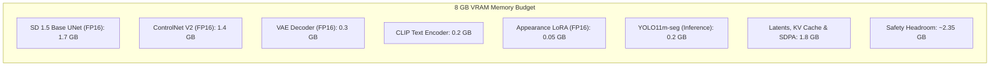

# JewelMind Generative Rendering V2 — Architectural Specification

## 1. High-Level Architectural Diagram

```mermaid
flowchart TD
    subgraph Client ["Frontend Studio Application"]
        UI[Design Studio Canvas]
        Modal[AiRenderModal]
        ClientService[aiRenderingService]
        UI --> Modal --> ClientService
    end

    subgraph BackendAPI ["FastAPI Application (Port 8000)"]
        Router["/api/v1/ai/render"]
        AuthMiddleware[JWT Auth & Tenant Scoping]
        ProxyHandler[Async HTTPX Forwarder]
        DB[(PostgreSQL / SQLite)]
        CloudStorage[Supabase Storage Service]

        ClientService --> Router --> AuthMiddleware --> ProxyHandler
        ProxyHandler --> DB
        ProxyHandler --> CloudStorage
    end

    subgraph AIWorkerService ["AI Worker Service (Port 8001 / CUDA)"]
        WorkerRoute["POST /render"]
        ConcurrencyLock[Async GPU Lock (1 Job at a time)]
        UnifiedEngine[UnifiedJewelleryRenderingEngine]
        
        ProxyHandler -->|Multipart Form| WorkerRoute
        WorkerRoute --> ConcurrencyLock --> UnifiedEngine
    end

    subgraph PipelineRouting ["Mode Routing & Preprocessing"]
        UnifiedEngine --> ModeRouter{Mode Router}
        
        %% Mode 1: Sketch
        ModeRouter -->|Mode: SKETCH| SketchPipe[LineArt Neural Preprocessor]
        SketchPipe --> StructCondition[512x512 LineArt Condition]

        %% Mode 2: Text
        ModeRouter -->|Mode: TEXT| TextPipe[Text Prompt Formatter]
        TextPipe --> ZeroCondition[Zero Conditioning Tensor]

        %% Mode 3: Photo
        ModeRouter -->|Mode: PHOTO| PhotoPipe[YOLO V2 Multi-Jewellery Seg]
        PhotoPipe --> MaskCrop[Mask Isolation & Background Removal]
        MaskCrop --> BilateralFilter[Bilateral Edge Preprocessor]
        BilateralFilter --> PhotoCondition[512x512 Filtered LineArt]
    end

    subgraph GenerativeCore ["Generative Core (RTX 4060 8GB / FP16)"]
        SD15[Stable Diffusion 1.5 UNet - Frozen]
        ControlNet[Jewellery ControlNet V2 (LineArt)]
        LoRA[Appearance LoRA V2 (Metal & Gemstones)]
        Scheduler[UniPCMultistepScheduler - 20 Steps]

        StructCondition --> ControlNet
        ZeroCondition --> ControlNet
        PhotoCondition --> ControlNet

        ControlNet -->|Residual Feature Blocks| SD15
        LoRA -->|Cross-Attention Modifiers| SD15
        SD15 --> Scheduler
        Scheduler --> VAEDecoder[VAE Decoder - FP16]
    end

    VAEDecoder --> OutputPNG[Rendered Image PNG]
    OutputPNG --> WorkerRoute
    CloudStorage -->|CDN URL| ClientService
```

---

## 2. Multi-Modal Conditioning Matrix

| Input Mode | Primary Conditioning Signal | Auxiliary Conditioning | ControlNet Scale | Typical Latency (RTX 4060) |
|---|---|---|:---:|:---:|
| **Sketch → Render** | Neural LineArt ($512\times 512$) | Metal/Gem Text Prompt | `0.85` | $3.1\text{s}$ |
| **Text → Render** | CLIP Text Embeddings | Category Anchor Tokens | `0.00` | $2.6\text{s}$ |
| **Photo → Render** | Isolated Jewellery LineArt | Target Material Prompt | `0.75` | $3.8\text{s}$ (includes YOLO V2 seg) |
| **Sketch + Text** | User Canvas Blueprint | Custom Natural Language Prompt | `0.85` | $3.2\text{s}$ |
| **Photo + Text** | Uploaded Physical Item Crop | Transformed Material Prompt | `0.75` | $3.8\text{s}$ |

---

## 3. Hardware & Memory Guardrails (8 GB VRAM)



* **Peak Inference VRAM**: $\approx 5.65\text{ GB} \le 8.0\text{ GB}$ (2.35 GB buffer prevents OOM).
* **Peak Training VRAM (ControlNet V2)**: $\approx 7.20\text{ GB}$ (Batch 1, Grad Accum 4, FP16, Gradient Checkpointing enabled).
