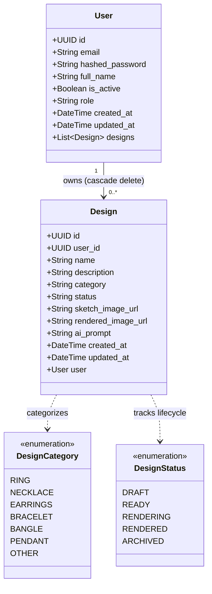
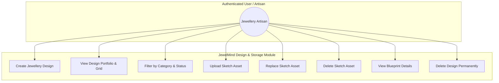
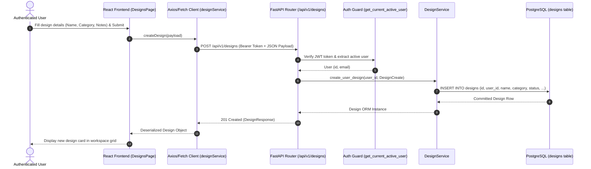
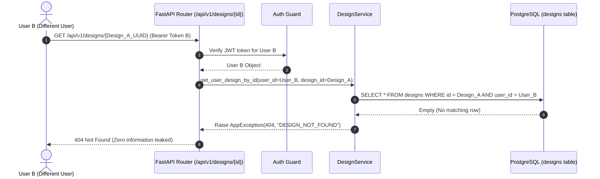
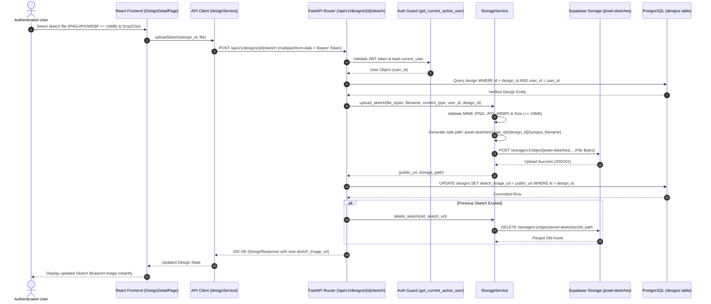

# UML & Architectural Models Specification

> **Document Version:** 1.4.0 (Phase 4 Sketch Upload & Storage)  
> **Status:** Architectural Models & Sketch Storage Specification  

---

## 1. Class Diagram (Phase 3 & 4 Core Domain)

---

## 2. Use Case Diagram (Jewellery Design & Sketch Management)

---

## 3. Sequence Diagram (Design Creation & Ownership Verification)

---

## 4. Sequence Diagram (Multi-Tenant Unauthorized Access Prevention)

---

## 5. Sequence Diagram (Sketch Upload & Storage Flow)

